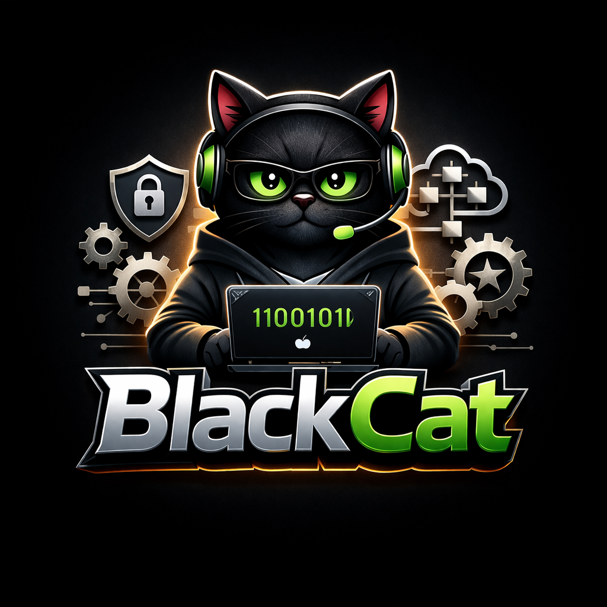
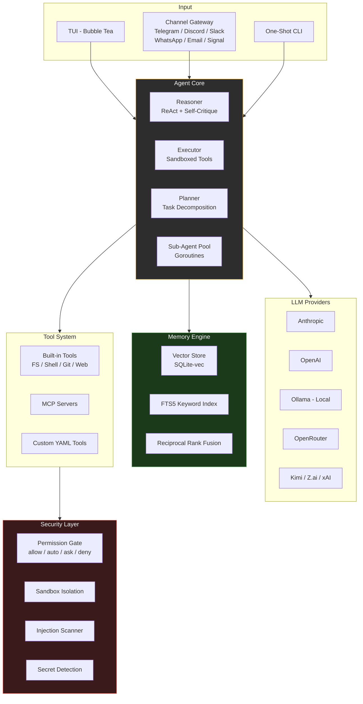

<p align="center">
  
</p>

<h1 align="center">🐈‍⬛ BlackCat</h1>

<p align="center">
  <strong>Your DevSecOps engineer and Solution Architect — in a 15MB binary.</strong>
</p>

<p align="center">
  Scan secrets &middot; Harden pipelines &middot; Design architecture &middot; Generate Terraform &middot; Review compliance &middot; Optimize costs<br/>
  <em>Open source AI agent by <a href="https://github.com/Meow-AIs">MeowAI</a> — 8 LLM providers, embedded memory, runs anywhere.</em>
</p>

<p align="center">
  <a href="https://github.com/Meow-AIs/BlackCat/actions"></a>
  <a href="go.mod"></a>
  <a href="LICENSE"></a>
  
  
  
  
</p>

---

## What is BlackCat?

BlackCat is an **AI agent specialized in DevSecOps and Solution Architecture**. It's not a general-purpose chatbot — it's a domain expert that understands security scanning, vulnerability prioritization, CI/CD pipeline hardening, infrastructure design, cloud architecture (AWS/GCP/Azure/Alibaba), Terraform/OpenTofu, reliability engineering, and incident response.

### What BlackCat Does

- **🔒 DevSecOps**: Scan secrets (16 Gitleaks rules), prioritize vulnerabilities (EPSS+KEV+CVSS), generate SBOMs (CycloneDX), scan Dockerfiles & IaC (22 rules), audit code (36 SAST rules across Go/Python/JS), map compliance (SOC2/ISO27001/PCI-DSS/HIPAA), generate & harden CI/CD pipelines, produce RCA reports
- **🏗️ Solution Architect**: Design with 10+ architecture patterns, generate C4/sequence/flow diagrams, select databases (15+ DBs scored), plan capacity, review with WAF (6 pillars), manage 104+ cloud services across 4 providers, write Terraform modules (16 patterns), engineer reliability (21 patterns, SLI/SLO, runbooks), optimize costs, plan migrations, review APIs
- **🛡️ Security-First**: Encrypted secret store, sandboxed execution, prompt injection scanning, output sanitization, skill security scanning before install

### How It's Built

Single Go binary (~15MB) with embedded vector memory, 8 LLM providers (including free local via Ollama), channel messaging (Telegram/Discord/Slack/WhatsApp/Signal/Email), plugin system, and 30+ slash commands. No cloud dependency. No Docker required.

---

## Quick Start

```bash
# Install (Linux/macOS)
curl -fsSL https://raw.githubusercontent.com/Meow-AIs/BlackCat/main/scripts/install.sh | bash

# Or build from source (requires CGo)
git clone https://github.com/Meow-AIs/BlackCat.git
cd blackcat
make build

# Initialize configuration
./blackcat init

# Set your LLM provider (stored in encrypted secret store)
./blackcat config set anthropic_api_key "sk-..."
# or via environment variable
export ANTHROPIC_API_KEY="sk-..."

# Start chatting
./blackcat                      # Interactive TUI
./blackcat serve                # Gateway daemon (channels + scheduler)

# DevSecOps examples
./blackcat "scan this repo for hardcoded secrets and vulnerabilities"
./blackcat "generate an SBOM for this project"
./blackcat "harden the CI/CD pipeline in .github/workflows/"
./blackcat "create an RCA report for the database outage last night"

# Solution Architect examples
./blackcat "design a microservices architecture for an e-commerce platform"
./blackcat "compare PostgreSQL vs DynamoDB for our use case"
./blackcat "generate a C4 diagram for this codebase"
./blackcat "create Terraform modules for our AWS infrastructure"
./blackcat "review this architecture for reliability and cost optimization"
```

---

## Key Features

### DevSecOps Capabilities

| | Capability | Details |
|---|-----------|---------|
| 🔍 | **Secret Scanning** | 16 Gitleaks-compatible rules — AWS keys, GitHub tokens, private keys, connection strings |
| 🎯 | **Vuln Prioritization** | EPSS + KEV + CVSS + reachability scoring — not just CVSS alone |
| 📋 | **SBOM Generation** | CycloneDX 1.5 from go.mod, package.json, requirements.txt, Cargo.toml |
| 🐳 | **Dockerfile Scanning** | 8 CIS Docker Benchmark rules |
| 🏗️ | **IaC Scanning** | 11 Terraform + 11 Kubernetes security rules |
| 💻 | **Code Scanning** | 36 SAST rules across Go, Python, JavaScript (OWASP Top 10) |
| ⚙️ | **Pipeline Generator** | GitHub Actions & GitLab CI with security gates, SHA-pinned actions |
| 📊 | **Compliance Mapping** | SOC2, ISO27001, PCI-DSS, CIS, NIST-CSF, HIPAA |
| 🚨 | **RCA Reporting** | 5-Whys, timeline, action items, executive summary, postmortem template |
| 🛡️ | **Threat Intelligence** | CISA KEV + EPSS feeds, findings aggregation (DefectDojo pattern) |

### Solution Architect Capabilities

| | Capability | Details |
|---|-----------|---------|
| 📐 | **Architecture Patterns** | 10+ patterns (Circuit Breaker, CQRS, Saga, Event Sourcing, etc.) with tradeoffs |
| 📊 | **C4 Diagrams** | Context, Container, Sequence, Flowchart — Mermaid syntax output |
| 📝 | **ADR Generator** | MADR template with options, pros/cons, decision recording |
| 🗄️ | **Database Selection** | 15 databases scored by requirements (scale, consistency, features, budget) |
| 📈 | **Capacity Planning** | RPS, bandwidth, storage projections with monthly growth |
| ✅ | **WAF Review** | 6 pillars (security, reliability, performance, cost, ops, sustainability), 30 questions |
| ☁️ | **Cloud Knowledge** | 104+ services across AWS, GCP, Azure, Alibaba with cross-cloud equivalence mapping |
| 🏗️ | **Terraform/OpenTofu** | 16 module patterns, state backend advice, 17 best practices |
| 🔄 | **Reliability Engineering** | 21 patterns, SLI/SLO, error budgets, burn rates, runbook generation |
| 💰 | **Cost Optimization** | Waste detection (10 rules), right-sizing, reserved instance recommendations |

### Agent Infrastructure

| | Feature | Description |
|---|---------|-------------|
| 🧠 | **Vector Memory** | 3-tier (episodic/semantic/procedural), FTS5 + vector KNN + RRF hybrid retrieval |
| 🔌 | **8 LLM Providers** | Anthropic, OpenAI, Ollama (local), OpenRouter, Groq, Z.ai/GLM, Kimi, xAI/Grok |
| 💬 | **Channel Gateway** | Telegram, Discord, Slack, WhatsApp, Signal, Email — all from single binary |
| 🎯 | **Accuracy Engine** | Trust scoring, output grounding, fact checking, semantic tool filtering |
| 🔧 | **Plugin System** | JSON-RPC plugins for custom providers, channels, domains |
| 📦 | **Skill Marketplace** | Install/publish skills with security scanning (30+ threat patterns) |
| ⚡ | **30+ Slash Commands** | Instant actions without LLM: `/scan`, `/memory`, `/skills`, `/config` |
| 🎤 | **Multimodal** | Image vision + Groq Whisper voice transcription (free) |

---

## Architecture



**Data flow:** User input arrives via TUI, CLI, or a channel adapter. The Agent Core runs a ReAct loop — the Reasoner builds the LLM prompt (injecting a frozen memory snapshot), the Executor dispatches tool calls through the security sandbox, and the Planner decomposes complex tasks into sub-agent goroutines. At session end, new knowledge is extracted, embedded, and persisted to the single `memory.db` file.

---

<details>
<summary><strong>🔌 LLM Providers</strong></summary>

BlackCat supports 8 built-in providers plus any OpenAI-compatible endpoint. The model router automatically selects the right model tier by task type.

| Provider | Key | Streaming | Vision | Local |
|----------|-----|-----------|--------|-------|
| **Anthropic** | `ANTHROPIC_API_KEY` | Yes | Yes | No |
| **OpenAI** | `OPENAI_API_KEY` | Yes | Yes | No |
| **Ollama** | — | Yes | Depends | Yes |
| **OpenRouter** | `OPENROUTER_API_KEY` | Yes | Depends | No |
| **Groq** | `GROQ_API_KEY` | Yes | No | No |
| **Kimi** (Moonshot) | `KIMI_API_KEY` | Yes | No | No |
| **Z.ai / GLM** | `ZAI_API_KEY` | Yes | No | No |
| **xAI / Grok** | `XAI_API_KEY` | Yes | No | No |

**Model routing** (automatic):

| Task Type | Tier | Example |
|-----------|------|---------|
| Complex reasoning, planning | Main | Claude Sonnet 4.6, GPT-4.1 |
| Code generation, vision | Main | Claude Sonnet 4.6, GPT-4.1 |
| Summarize, classify, sub-agents | Auxiliary | Claude Haiku 4.5, GPT-4.1-mini |
| Embedding | Local | Bundled ONNX MiniLM, Ollama |

All providers implement the same `Provider` interface (`Chat`, `Stream`, `Models`, `Name`), so adding a new one is straightforward.

</details>

<details>
<summary><strong>🧠 Memory System</strong></summary>

BlackCat uses a three-tier vector memory stored in a single SQLite file (`~/.blackcat/memory.db`):

### Tier 1: Episodic Memory — *What happened?*
- Conversation summaries (not raw transcripts)
- Tool call results, errors, and resolutions
- Time-weighted decay (30-day default retention)

### Tier 2: Semantic Memory — *What do I know?*
- Project context, file structures, coding patterns
- User preferences and style
- No decay — permanent until invalidated

### Tier 3: Procedural Memory — *How do I do it?*
- Learned skills (step-by-step procedures)
- Custom workflows and tool chains
- Scored by success rate and usage frequency

### Hybrid Retrieval Pipeline

```
Query → FTS5 keyword search
      → sqlite-vec KNN (vector similarity)
      → Metadata SQL filters
      → Reciprocal Rank Fusion merge
      → Top-K ranked results
```

**Efficiency features:**
- Lazy embedding (summaries only, not raw text)
- Bundled MiniLM-L6-v2 ONNX model (no API calls needed)
- int8 quantization (384 dimensions, ~3.8MB for 10K vectors)
- Deduplication (cosine similarity > 0.95 triggers update instead of insert)
- Search latency < 10ms at 10K vectors

</details>

<details>
<summary><strong>🛡️ Security Model</strong></summary>

BlackCat implements defense-in-depth without requiring Docker:

### 4-Level Permission System

```yaml
permissions:
  allow:        # Silent — read_file, list_dir, git_status, search
  auto_approve: # Pattern match — write to src/**, run go test
  ask:          # User confirmation — rm, git push, curl
  deny:         # Blocked — rm -rf /, dangerous commands
```

### Sandbox Layers

1. **Command Validation** — deny-list pattern matching, argument sanitization, path traversal prevention
2. **Process Isolation** — subprocess timeouts, resource limits (memory/CPU), optional network blocking
3. **Output Sanitization** — secret detection in command output, path normalization, size limits
4. **Container (optional)** — Docker/Podman integration when available

### Encrypted Secret Store

API keys and tokens are stored in a tiered encrypted backend (OS Keychain > XChaCha20-Poly1305 encrypted file > env vars) — **never in plaintext config files**. Secrets are resolved at runtime for tool execution via env var injection and are **never sent to external LLM providers**. A 5-layer sanitization pipeline (registered secrets, regex patterns, connection string scrubbing, agent-level sanitizer, hook-based sanitizer) redacts any secret that appears in tool output, memory entries, or LLM messages before they leave the process.

Store API keys securely with `/config set`:
```
/config set anthropic_api_key sk-ant-...
```

See [docs/security.md](docs/security.md) for the full security model and [docs/configuration.md](docs/configuration.md#secret-management) for setup instructions.

### Additional Security

- **Prompt injection scanning** — 10 threat patterns detected and blocked in all external content
- **Smart approval** — pattern-based command risk classification (safe/moderate/dangerous)
- **Sub-agent isolation** — sub-agents are blocked from accessing secrets by default
- **Audit logging** — every secret access is logged with actor, action, and timestamp
- **No supply chain risk** — single binary, no npm/pip install required

</details>

<details>
<summary><strong>🏗️ Domain Expertise</strong></summary>

BlackCat includes two specialized domain modules that inject domain-specific system prompts, tools, and knowledge.

### DevSecOps Module

| Capability | Description |
|-----------|-------------|
| Secret Scanning | 16 Gitleaks-based rules for detecting hardcoded secrets |
| Vulnerability Priority | EPSS + KEV + CVSS + reachability-based scoring |
| Dockerfile Scanning | CIS benchmark compliance checks |
| SBOM Generation | CycloneDX format |
| CI/CD Pipelines | Generation with security hardening |
| IaC Scanning | Infrastructure-as-code analysis |
| Compliance Mapping | Framework mapping (SOC2, PCI-DSS, etc.) |
| Code Scanning | 36 SAST rules across Go, Python, JavaScript |
| RCA Reporting | 5-Whys, timeline, action items, postmortem template |
| Threat Intelligence | CISA KEV + EPSS feeds, findings aggregation |
| System Hardening | CIS Benchmark rules for Linux (SSH, network, filesystem, kernel) |
| Deployment Strategies | Blue-green, canary, rolling, recreate scoring and K8s manifests |

### Solution Architect Module

| Capability | Description |
|-----------|-------------|
| Pattern Knowledge | 10+ architecture patterns with trade-off analysis |
| Diagram Generation | C4, sequence, and flowchart diagrams (Mermaid) |
| ADR Generator | MADR-format Architecture Decision Records |
| Database Selection | Decision tree for choosing the right DB |
| Capacity Planning | Resource estimation and scaling guidance |
| WAF Review | 6-pillar Well-Architected Framework review |
| Cloud Knowledge | 104+ services across AWS, GCP, Azure, Alibaba with cross-cloud equivalence mapping |
| Cost Estimation | Cross-cloud cost comparison engine |
| Terraform/OpenTofu | 16 module patterns with best practices |
| Reliability Engineering | 21 patterns, SLI/SLO, runbook generation |
| Cost Optimization | Waste detection, right-sizing, reserved instance recommendations |
| SLA Mapping | Availability tiers to infrastructure requirements |
| Migration Planning | Rehost/replatform/refactor strategies with phased plans |
| API Design Review | REST/gRPC best practices evaluation |

</details>

<details>
<summary><strong>🔧 Tool System</strong></summary>

All tools — built-in, MCP, and custom — register through a unified registry (`internal/tools/registry.go`).

### Built-in Tools

| Category | Tools |
|----------|-------|
| Filesystem | `read_file`, `write_file`, `edit_file`, `list_dir`, `search_files`, `search_content` |
| Shell | `execute` (sandboxed), `background` |
| Git | `status`, `diff`, `log`, `commit`, `branch` |
| Code | `analyze`, `format`, `test`, `build` |
| Web | `fetch` (HTTP), `search` (web search) |
| Browser | `navigate`, `screenshot` |
| MCP | `connect`, `call`, `list` |
| Agent | `spawn` (sub-agent for parallel tasks) |

### MCP Integration

Connect any MCP-compatible server:

```yaml
# .blackcat.yaml
mcp_servers:
  - name: "context7"
    command: "npx"
    args: ["-y", "@context7/mcp-server"]
  - name: "filesystem"
    command: "npx"
    args: ["-y", "@modelcontextprotocol/server-filesystem", "/path"]
```

### Custom Tools (YAML)

Define tools without code:

```yaml
# .blackcat.yaml
tools:
  - name: deploy
    description: "Deploy to production"
    command: "bash scripts/deploy.sh {{environment}}"
    parameters:
      environment:
        type: string
        enum: [staging, production]
    permission: ask
```

### Tool Repair

When the LLM hallucinates a tool name, BlackCat applies 3-strategy fuzzy matching to find the intended tool automatically.

</details>

<details>
<summary><strong>💬 Channel Gateway</strong></summary>

Run `blackcat serve` to expose BlackCat as a bot on multiple messaging platforms simultaneously:

| Channel | Adapter | Status |
|---------|---------|--------|
| Telegram | Bot API | Implemented |
| Discord | Bot Gateway | Implemented |
| Slack | Socket Mode | Implemented |
| WhatsApp | Baileys (Node bridge) | Implemented |
| Email | IMAP/SMTP | Implemented |
| Signal | Signal CLI bridge | Implemented |

```yaml
# ~/.blackcat/config.yaml
channels:
  telegram:
    token: "${TELEGRAM_BOT_TOKEN}"
    allowed_users: [123456789]
  discord:
    token: "${DISCORD_BOT_TOKEN}"
    allowed_guilds: ["..."]
  slack:
    app_token: "${SLACK_APP_TOKEN}"
    bot_token: "${SLACK_BOT_TOKEN}"
```

Features:
- Per-channel rate limiting
- Device pairing for WhatsApp/Signal
- Session continuity across channels
- Memory shared across all channels

</details>

---

## Configuration

BlackCat uses a layered YAML configuration: global (`~/.blackcat/config.yaml`) with project-level overrides (`.blackcat.yaml`).

```yaml
# ~/.blackcat/config.yaml
model: "anthropic/claude-sonnet-4-6"

memory:
  enabled: true
  max_vectors: 10000                   # Max vectors before eviction
  retention_days: 30                   # Episodic memory retention
  embedding: local                     # local (bundled ONNX), openai, or ollama

agent:
  max_sub_agents: 3
  sub_agent_model: "anthropic/claude-haiku-4-5"

permissions:
  allow:
    - action: read_file
    - action: list_directory
  deny:
    - action: shell
      patterns: ["rm -rf /*", "mkfs*"]

scheduler:
  enabled: true
  schedules:
    - name: "daily-summary"
      cron: "0 9 * * *"
      task: "Summarize yesterday's git commits"

# Channel config, MCP servers, domain modules, etc.
# See docs/ for full reference.
```

---

## What BlackCat Can Do For You

> Most AI coding agents help you write code. BlackCat helps you **ship secure, well-architected software**.

### Scenario 1: "We just had a security incident"

You're on-call at 2 AM. The PagerDuty alert says credentials may have been leaked.

```
You:  "Scan the entire repo for hardcoded secrets and leaked credentials"
Cat:  Found 3 hardcoded secrets:
      - AWS access key in config/deploy.go (line 42)
      - Stripe secret key in handlers/payment.go (line 118)
      - Database connection string in docker-compose.yml (line 7)
      Severity: CRITICAL. Generating RCA report...

You:  "Create an RCA report for this incident"
Cat:  Generated postmortem with timeline, 5-Whys analysis, action items,
      and executive summary. Saved to docs/incident-2026-03-23-rca.md
```

### Scenario 2: "Design the architecture for our new microservice"

Your team needs to break apart a monolith. You need a plan, not just code.

```
You:  "Design a microservices architecture for our e-commerce platform.
       We need 99.99% availability, handle 10K RPS, and keep costs under $5K/month."

Cat:  Based on your requirements, I recommend:
      - Architecture: Event-driven with CQRS pattern
      - Database: PostgreSQL (ACID) + Redis (cache) + Kafka (events)
      - Deployment: EKS on AWS with blue-green deployment
      - Estimated infra: $3,200/month (within budget)

      [Generates C4 context diagram in Mermaid]
      [Generates ADR for the CQRS decision]
      [Creates capacity planning projection for 12 months]
      [Reviews against WAF 6 pillars: all scores > 4.0]
```

### Scenario 3: "Harden our CI/CD pipeline before the SOC2 audit"

Compliance deadline is next week. You need evidence that your pipeline is secure.

```
You:  "Audit our GitHub Actions workflows for security issues and generate
       a compliance report for SOC2"

Cat:  Pipeline audit found 5 issues:
      - CRITICAL: actions/checkout@v4 uses mutable tag (should pin SHA)
      - HIGH: No permissions: block (defaults to write-all)
      - MEDIUM: Secrets in environment variables
      Generating hardened pipeline...

      SOC2 compliance gap report:
      - 85% controls covered
      - 3 gaps: access logging, change management approval, encryption at rest
      [Saves to docs/soc2-gap-report.md]
```

### Scenario 4: "Migrate our infrastructure to Terraform"

You're moving from ClickOps to Infrastructure as Code.

```
You:  "Create Terraform modules for our AWS setup: VPC with 3 AZs,
       EKS cluster, RDS PostgreSQL, and ElastiCache Redis"

Cat:  Generated 4 Terraform modules following best practices:
      - modules/vpc/ (3 AZs, public/private subnets, NAT gateway)
      - modules/eks/ (managed node group, IRSA, cluster autoscaler)
      - modules/rds/ (Multi-AZ, encrypted, automated backups)
      - modules/redis/ (cluster mode, encryption in transit)

      State backend: S3 + DynamoDB locking (recommended)
      OpenTofu compatible: Yes
      Estimated cost: $1,850/month
```

### Scenario 5: "Our database is slow, what should we do?"

Performance issues in production. You need the right database for your workload.

```
You:  "We have 500GB of time-series IoT data with 50K writes/sec and need
       sub-second queries. Currently on PostgreSQL and it's dying."

Cat:  PostgreSQL is not ideal for this workload. Recommendations:
      1. TimescaleDB (score: 92) — PostgreSQL extension, easiest migration
      2. InfluxDB (score: 87) — purpose-built for time-series
      3. ClickHouse (score: 81) — best for analytical queries

      Migration plan: Strangler Fig pattern over 3 phases
      [Generates ADR documenting the decision]
      [Creates capacity projection: 2TB in 6 months at current growth]
```

---

## Why BlackCat Over Other AI Agents?

Other AI agents are **general-purpose coding assistants**. They can write code, but they don't understand security posture, architecture trade-offs, or compliance requirements. BlackCat is different.

### DevSecOps: What Others Can't Do

| Capability | Other AI Agents | **BlackCat** |
|-----------|:--------------:|:------------:|
| Secret Scanning (built-in) | Not available | **16 Gitleaks rules** |
| Vulnerability Prioritization | Not available | **EPSS + KEV + CVSS tri-layer** |
| SBOM Generation | Not available | **CycloneDX 1.5** |
| IaC Security Scanning | Not available | **22 Terraform + K8s rules** |
| Code Security (SAST) | Not available | **36 rules (Go/Python/JS)** |
| CI/CD Pipeline Generation | Not available | **GitHub Actions + GitLab CI** |
| Compliance Mapping | Not available | **6 frameworks (SOC2, ISO, PCI...)** |
| RCA / Incident Reports | Not available | **5-Whys + timeline + action items** |
| Threat Intelligence | Not available | **CISA KEV + EPSS feeds** |
| System Hardening | Not available | **36 CIS benchmark rules** |

### Architecture: What Others Can't Do

| Capability | Other AI Agents | **BlackCat** |
|-----------|:--------------:|:------------:|
| C4 Architecture Diagrams | Not available | **Mermaid output (4 levels)** |
| ADR Generator | Not available | **MADR template** |
| Database Selection Engine | Not available | **15 databases scored** |
| Cloud Service Knowledge | Not available | **104+ services, 4 clouds** |
| Terraform/OpenTofu Patterns | Not available | **16 module patterns** |
| Reliability Engineering | Not available | **21 patterns + SLI/SLO** |
| Cost Optimization | Not available | **10 waste detection rules** |
| WAF Review | Not available | **6 pillars, 30 questions** |
| SLA-to-Infrastructure | Not available | **Automatic tier mapping** |
| Migration Planning | Not available | **Strangler Fig / Big Bang / Parallel** |

### Infrastructure: What Makes BlackCat Different

| Feature | Typical AI Agent | **BlackCat** |
|---------|:---------------:|:------------:|
| Binary Size | 100-300MB+ | **~15MB** |
| Memory System | None or session-only | **3-tier vector DB + RRF** |
| LLM Providers | 1-5 | **8 built-in + Ollama local** |
| Channel Messaging | None | **6 channels (TG/Discord/Slack...)** |
| Plugin System | None or limited | **JSON-RPC with bridges** |
| Skill Marketplace | None or basic | **Install + publish + security scan** |
| Hook / Event System | None | **15 event types** |
| Encrypted Secrets | Plaintext config | **OS Keychain + XChaCha20** |
| Interactive Shell | Hangs on ssh/python | **Session manager + 30 commands detected** |
| Multimodal | Text only | **Image vision + Groq Whisper voice** |

---

## Documentation

| Guide | Description |
|-------|-------------|
| [Architecture](docs/architecture.md) | System design, data flow, package structure, all subsystems |
| [Configuration](docs/configuration.md) | Full config.yaml reference, env vars, provider setup |
| [LLM Providers](docs/providers.md) | All 8 providers setup, model router, cost tracking |
| [Security](docs/security.md) | Threat model, permissions, sandbox, encryption, injection scanning |
| [DevSecOps Guide](docs/devsecops.md) | Secret scanning, vuln priority, SBOM, IaC, compliance, RCA |
| [Architect Guide](docs/architect.md) | Patterns, diagrams, DB selection, cloud, Terraform, reliability |
| [Memory System](docs/memory-system.md) | 3-tier memory, hybrid retrieval, embedding, decay |
| [Plugins](docs/plugins.md) | Plugin development, JSON-RPC protocol, bridges |
| [Skills & Marketplace](docs/skills.md) | Install/publish skills, package format, security scanning |
| [Channels](docs/channels.md) | Telegram, Discord, Slack, WhatsApp, Signal, Email setup |
| [Slash Commands](docs/commands.md) | All 30+ commands reference |
| [Scheduler](docs/scheduler.md) | Cron tasks, output routing, DevSecOps automation |
| [Contributing](CONTRIBUTING.md) | Fork workflow, TDD, code style, PR process |

---

## Development

```bash
# Build (requires CGo for SQLite + sqlite-vec + ONNX)
make build

# Build all platforms (uses zig cc for cross-compilation)
make build-all

# Run tests
make test                     # Unit tests
make test-integration         # Integration tests
make test-e2e                 # End-to-end tests
make bench                    # Benchmarks

# Run a specific test
go test ./internal/memory/... -run TestHybridRetrieval -v

# Lint and format
make lint
make vet
make fmt

# Clean build artifacts
make clean
```

### Project Stats

| Metric | Value |
|--------|-------|
| Source files | 195 |
| Test files | 165 |
| Test functions | 2,382 |
| Total lines of Go | ~72,000 |
| Packages | 33 |

### Performance Targets

| Metric | Target |
|--------|--------|
| Binary size | < 18MB |
| Startup time | < 500ms |
| Vector search (10K vectors) | < 10ms |
| Memory (idle) | < 50MB |

---

## Contributing

Contributions are welcome. Please read [CONTRIBUTING.md](CONTRIBUTING.md) for guidelines on how to get started.

---

## License

[MIT](LICENSE) &copy; MeowAI
