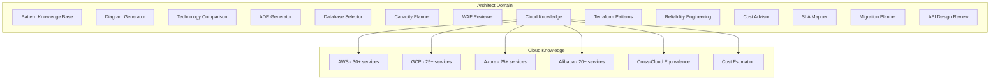
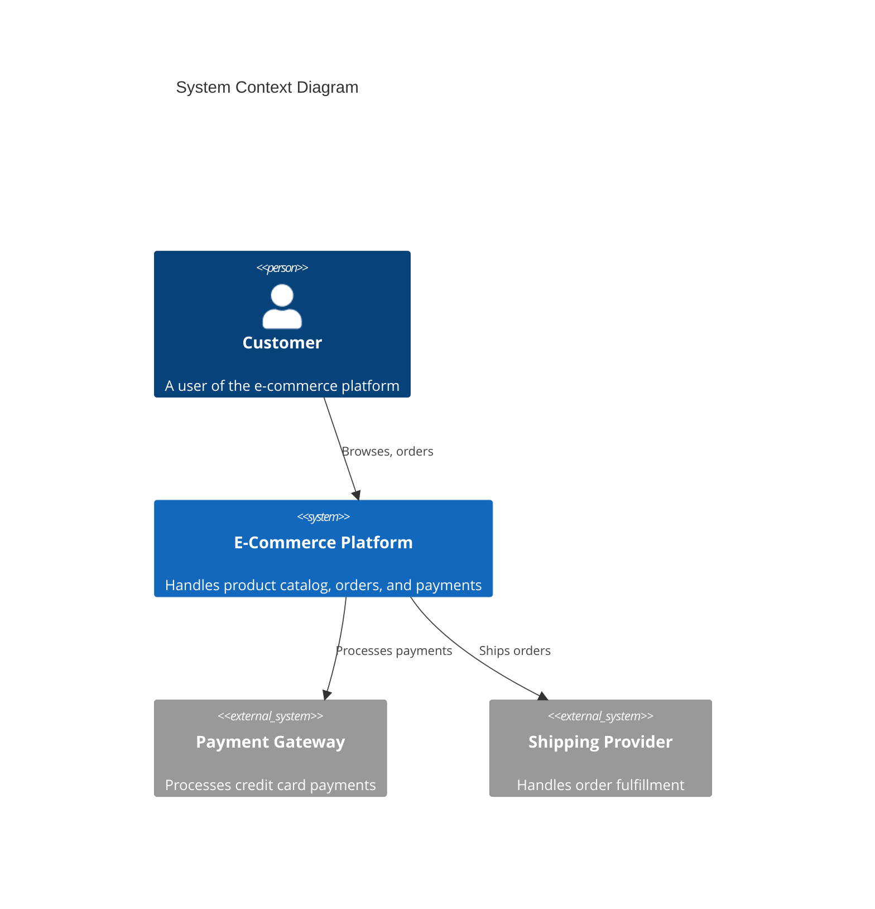

# Architect Domain Guide

> BlackCat's Architect domain for system design, pattern knowledge, diagram generation, and cloud architecture. For the DevSecOps domain, see [DevSecOps](./devsecops.md). For architecture fundamentals, see [Architecture](./architecture.md).

## Overview

The Architect domain (`internal/domains/architect/`) provides system design and architecture capabilities. Activate it with:

```
/domain set architect
```



## Pattern Knowledge Base

The pattern knowledge base (`internal/domains/architect/patterns.go`) stores structured architecture pattern knowledge.

### Pattern Structure

```go
type Pattern struct {
    Name         string
    Category     PatternCategory   // creational, structural, behavioral, architectural, cloud, data, integration, resilience
    Description  string
    Problem      string            // what problem it solves
    Solution     string            // how it solves it
    Tradeoffs    []string          // pros and cons
    UseCases     []string          // when to use
    AntiPatterns []string          // when NOT to use
    RelatedTo    []string          // related patterns
    Tags         []string
}
```

### Built-in Patterns (10+)

| Category | Patterns |
|----------|----------|
| **Architectural** | Microservices, Event-Driven, Hexagonal/Ports-and-Adapters |
| **Cloud** | CQRS, Event Sourcing, Saga Pattern |
| **Resilience** | Circuit Breaker, Bulkhead, Retry with Backoff |
| **Data** | Repository Pattern, Unit of Work |
| **Integration** | API Gateway, Service Mesh |

### Usage

```
What pattern should I use for this distributed transaction?
Compare CQRS vs traditional CRUD for our use case
When should I NOT use microservices?
```

## C4 Diagram Generation

Generates architecture diagrams using C4 model notation with Mermaid.

### Diagram Levels

| Level | Description | Use Case |
|-------|-------------|----------|
| **Context** (C1) | System context -- actors and external systems | Stakeholder communication |
| **Container** (C2) | Application containers -- services, databases, queues | Development team overview |
| **Component** (C3) | Components within a container | Detailed design |
| **Code** (C4) | Code-level classes/interfaces | Implementation planning |

### Additional Diagram Types

| Type | Format | Use Case |
|------|--------|----------|
| **Sequence** | Mermaid sequence diagram | API flow, interaction design |
| **Flowchart** | Mermaid flowchart | Process flows, decision trees |

### Usage

```
Generate a C4 context diagram for our e-commerce system
Create a sequence diagram for the checkout flow
Draw a container diagram showing our microservices
```

### Example Output



## Technology Comparison Matrix

Generates structured comparison matrices for technology decisions.

### Comparison Dimensions

| Dimension | Description |
|-----------|-------------|
| Features | Feature checklist comparison |
| Performance | Throughput, latency, scalability benchmarks |
| Cost | Licensing, infrastructure, operational costs |
| Community | GitHub stars, Stack Overflow activity, releases |
| Maturity | Age, stability, enterprise adoption |
| Integration | Ecosystem compatibility, API quality |
| Learning Curve | Documentation quality, complexity |

### Usage

```
Compare PostgreSQL vs CockroachDB vs TiDB for our use case
Compare Kafka vs RabbitMQ vs NATS for event streaming
Create a comparison matrix for React vs Vue vs Svelte
```

## ADR Generator

Generates Architecture Decision Records in MADR (Markdown Any Decision Records) format.

### MADR Template

```markdown
# ADR-001: Choose Message Queue

## Status
Accepted

## Context
We need an asynchronous message queue for order processing events.
The system handles 10,000 orders/hour at peak.

## Decision
We will use Apache Kafka.

## Consequences
### Positive
- High throughput (100K+ messages/sec)
- Built-in partitioning and replication
- Strong ecosystem (Kafka Connect, Streams)

### Negative
- Operational complexity (ZooKeeper/KRaft)
- Higher learning curve than RabbitMQ
- Requires more infrastructure

## Alternatives Considered
- RabbitMQ: simpler but lower throughput
- NATS: lightweight but less mature ecosystem
- AWS SQS: managed but vendor lock-in
```

### Usage

```
Create an ADR for choosing between REST and gRPC
Generate an ADR for our database selection
Write an ADR for adopting Kubernetes
```

## Database Selection

A decision tree covering 15+ databases with structured comparison.

### Database Categories

| Category | Databases |
|----------|-----------|
| **Relational** | PostgreSQL, MySQL, CockroachDB, TiDB |
| **Document** | MongoDB, DynamoDB, CouchDB |
| **Key-Value** | Redis, Memcached, DynamoDB |
| **Wide-Column** | Cassandra, ScyllaDB, HBase |
| **Graph** | Neo4j, Neptune, ArangoDB |
| **Time-Series** | InfluxDB, TimescaleDB, QuestDB |
| **Search** | Elasticsearch, OpenSearch, Meilisearch |

### Decision Factors

| Factor | Weight | Description |
|--------|--------|-------------|
| Consistency model | High | Strong vs. eventual consistency requirements |
| Scale | High | Data volume, query rate, growth projections |
| Query patterns | High | OLTP, OLAP, full-text search, graph traversal |
| Operational complexity | Medium | Self-managed vs. managed service |
| Cost | Medium | License, infrastructure, team expertise |
| Ecosystem | Medium | Language drivers, ORMs, tooling |

### Usage

```
Help me choose a database for a real-time analytics platform
Compare PostgreSQL and MongoDB for our e-commerce backend
What database should I use for a social graph with 10M users?
```

## Capacity Planning

Estimates infrastructure requirements based on workload parameters.

### Input Parameters

| Parameter | Description |
|-----------|-------------|
| Requests per second | Expected peak RPS |
| Data volume | Storage requirements and growth rate |
| Latency target | P50, P95, P99 targets |
| Availability target | 99.9%, 99.95%, 99.99% |
| Data retention | How long to keep data |
| Geographic distribution | Single region vs. multi-region |

### Output

- Compute instances (type, count)
- Memory requirements
- Storage (type, size, IOPS)
- Network bandwidth
- Database sizing
- Caching layer sizing
- CDN requirements
- Cost estimation

### Usage

```
Plan capacity for 50,000 concurrent users with 99.99% availability
Estimate infrastructure for a 10TB data warehouse with 1000 QPS
```

## WAF Review (Well-Architected Framework)

Reviews architecture against 6 pillars of the Well-Architected Framework.

### Six Pillars

| Pillar | Focus Areas |
|--------|-------------|
| **Operational Excellence** | Runbooks, monitoring, CI/CD, IaC, incident response |
| **Security** | IAM, encryption, network security, compliance, data protection |
| **Reliability** | Fault tolerance, disaster recovery, auto-scaling, health checks |
| **Performance Efficiency** | Compute optimization, caching, CDN, database tuning |
| **Cost Optimization** | Right-sizing, reserved capacity, spot instances, waste elimination |
| **Sustainability** | Energy efficiency, resource utilization, carbon footprint |

### Usage

```
Review our architecture against the Well-Architected Framework
Assess our security pillar readiness
What should we improve for operational excellence?
```

## Cloud Services Knowledge

The cloud knowledge base (`internal/domains/architect/cloud/`) contains structured data on 104+ services across 4 cloud providers.

### Service Coverage

| Provider | Services | Key Categories |
|----------|----------|---------------|
| **AWS** | 30+ | EC2, RDS, S3, Lambda, EKS, DynamoDB, SQS, CloudFront... |
| **GCP** | 25+ | Compute Engine, Cloud SQL, GCS, Cloud Run, GKE, BigQuery... |
| **Azure** | 25+ | VMs, SQL Database, Blob Storage, Functions, AKS, Cosmos DB... |
| **Alibaba** | 20+ | ECS, ApsaraDB, OSS, Function Compute, ACK... |

### Cross-Cloud Equivalence

The equivalence mapper (`internal/domains/architect/cloud/equivalence.go`) maps services across providers:

| Category | AWS | GCP | Azure | Alibaba |
|----------|-----|-----|-------|---------|
| Compute | EC2 | Compute Engine | VMs | ECS |
| Containers | EKS | GKE | AKS | ACK |
| Serverless | Lambda | Cloud Run | Functions | Function Compute |
| Object Storage | S3 | GCS | Blob Storage | OSS |
| RDBMS | RDS | Cloud SQL | SQL Database | ApsaraDB RDS |
| NoSQL | DynamoDB | Firestore | Cosmos DB | Tablestore |
| Message Queue | SQS | Pub/Sub | Service Bus | MNS |
| CDN | CloudFront | Cloud CDN | Front Door | CDN |

### Cost Estimation

The cost estimation engine (`internal/domains/architect/cloud/cost.go`) provides approximate costs for:
- Compute (per hour, per vCPU, per GB RAM)
- Storage (per GB/month)
- Data transfer (per GB)
- Managed services (per request, per hour)

### Usage

```
What's the AWS equivalent of Azure Cosmos DB?
Compare pricing for running Kubernetes on AWS vs GCP vs Azure
Recommend cloud services for a real-time data pipeline
```

## Terraform / OpenTofu Patterns

16 module patterns for infrastructure as code (`internal/domains/architect/terraform.go`).

### Module Categories

| Category | Patterns |
|----------|----------|
| **Networking** | VPC, subnets, security groups, load balancers |
| **Compute** | EC2/VM instances, auto-scaling groups, ECS/EKS clusters |
| **Data** | RDS, DynamoDB, Redis, S3 with lifecycle policies |
| **Serverless** | Lambda, API Gateway, Step Functions |
| **Security** | IAM roles/policies, KMS keys, WAF rules |
| **Monitoring** | CloudWatch, alerting, dashboards |

### Usage

```
Generate a Terraform module for a production-ready VPC
Create OpenTofu config for an EKS cluster with managed node groups
Show me a Terraform pattern for blue-green deployment
```

## Reliability Engineering

21 reliability patterns (`internal/domains/architect/reliability.go`).

### Pattern Categories

| Category | Patterns |
|----------|----------|
| **Fault Tolerance** | Circuit breaker, bulkhead, retry, timeout, fallback |
| **Data** | Replication, sharding, backup/restore, eventual consistency |
| **Deployment** | Blue-green, canary, rolling update, feature flags |
| **Observability** | Health checks, distributed tracing, structured logging, SLO dashboards |
| **Chaos** | Game days, fault injection, load testing, disaster recovery drills |

### Usage

```
Design a fault-tolerant payment processing system
What reliability patterns should we implement for 99.99% uptime?
Create a chaos engineering plan for our microservices
```

## Cost Optimization

The cost advisor (`internal/domains/architect/cost_advisor.go`) analyzes architecture for cost optimization opportunities.

### Optimization Categories

| Category | Recommendations |
|----------|----------------|
| **Right-sizing** | Underutilized instances, over-provisioned storage |
| **Reserved capacity** | Savings plans, reserved instances, committed use discounts |
| **Spot/preemptible** | Batch workloads, stateless services |
| **Architecture** | Caching, CDN, serverless conversion, data tiering |
| **Waste** | Unused resources, orphaned volumes, idle endpoints |

### Usage

```
Analyze our architecture for cost optimization
How can we reduce our AWS bill by 30%?
Compare on-demand vs reserved pricing for our workload
```

## SLA Mapping

Maps technical reliability metrics to business SLA tiers (`internal/domains/architect/sla.go`).

| Availability | Downtime/Year | Typical Use |
|-------------|---------------|-------------|
| 99.9% | 8.76 hours | Internal tools |
| 99.95% | 4.38 hours | Business applications |
| 99.99% | 52.6 minutes | Customer-facing services |
| 99.999% | 5.26 minutes | Financial, healthcare critical |

### Usage

```
What infrastructure do we need for 99.99% availability?
Map our SLA requirements to technical architecture
```

## Migration Planning

The migration planner (`internal/domains/architect/migration.go`) helps plan technology migrations.

### Migration Types

| Type | Description |
|------|-------------|
| **Rehost** | Lift and shift (move as-is) |
| **Replatform** | Minor modifications for cloud |
| **Refactor** | Re-architect for cloud-native |
| **Replace** | Replace with SaaS/managed service |
| **Retire** | Decommission |

### Usage

```
Plan a migration from on-premise to AWS
Create a migration roadmap from monolith to microservices
How should we migrate from MySQL to PostgreSQL?
```

## API Design Review

The API reviewer (`internal/domains/architect/api_review.go`) evaluates API designs against best practices.

### Review Dimensions

| Dimension | Checks |
|-----------|--------|
| **Naming** | Resource naming, URL structure, consistency |
| **Versioning** | Strategy (URL, header, content negotiation) |
| **Error Handling** | Standard error format, HTTP status codes |
| **Pagination** | Cursor vs offset, page size limits |
| **Security** | Authentication, authorization, rate limiting, input validation |
| **Performance** | Caching headers, compression, field selection |
| **Documentation** | OpenAPI spec completeness, examples |

### Usage

```
Review our REST API design
Evaluate this OpenAPI specification for best practices
Should we use REST or gRPC for service-to-service communication?
```

## Workflow Integration

The Architect domain provides 10 structured workflows (`internal/domains/architect/workflows.go`) for common architectural tasks:

1. **Architecture Review**: Full WAF assessment with recommendations
2. **Technology Comparison**: Comparison matrix + ADR generation
3. **Database Selection**: Requirements analysis + scored DB comparison
4. **Capacity Planning**: Workload analysis + infrastructure sizing
5. **Diagram Generation**: C4 and sequence diagram creation from requirements
6. **Migration Planning**: Assessment + migration plan + cost estimate
7. **Cost Optimization**: Resource analysis + waste detection + savings plan
8. **Security Architecture**: Threat modeling + security control design
9. **Incident Postmortem**: RCA report + timeline + action items
10. **API Design Review**: REST/gRPC best practices evaluation
