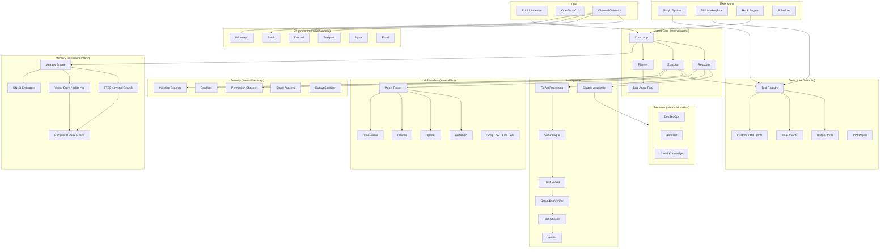
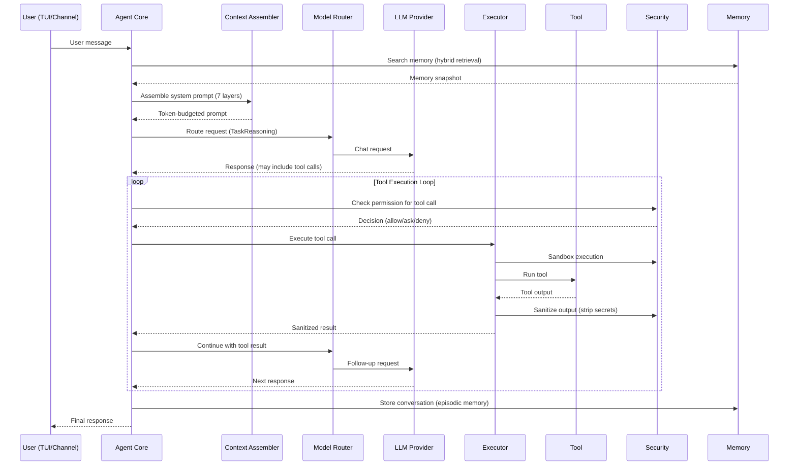
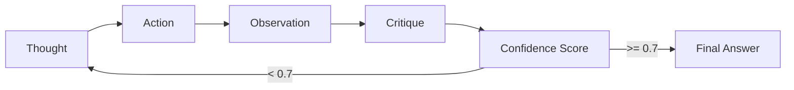
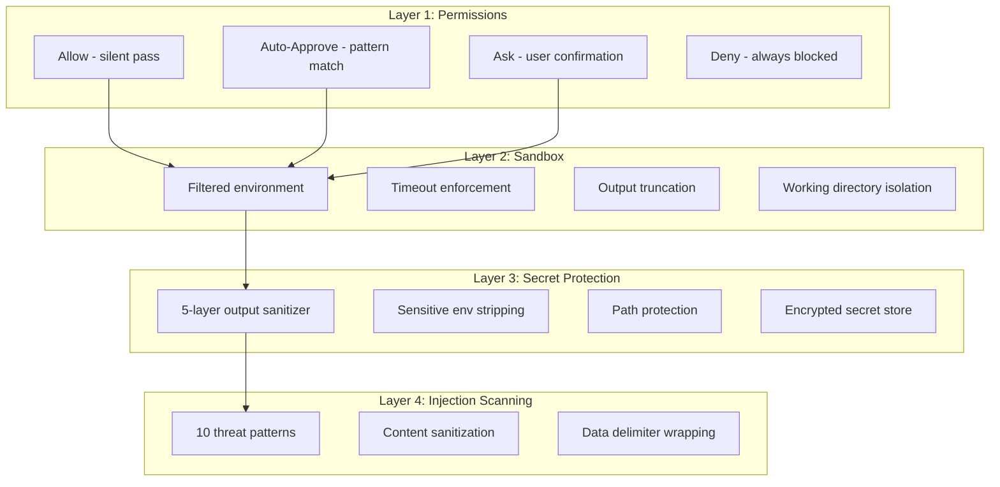
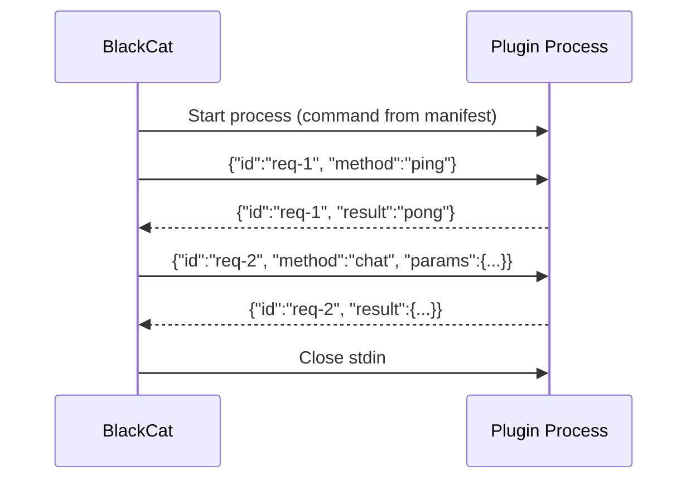
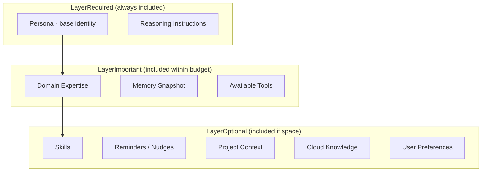
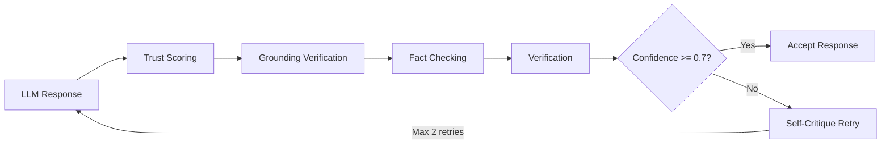

# BlackCat Architecture

> Full architecture reference for the BlackCat AI agent. For setup instructions, see [Configuration](./configuration.md). For security details, see [Security](./security.md).

## System Overview

BlackCat is a single-binary AI agent CLI (~15 MB) with embedded vector memory, multi-provider LLM support, MCP tools, channel messaging, sub-agents, and a built-in scheduler.



## Package Structure

```
blackcat/
├── cmd/blackcat/               # CLI entry point
│   └── main.go                 # Main binary: TUI, one-shot, serve modes
├── configs/                    # Example configuration files
├── embed/
│   └── model/                  # Embedded ONNX model (MiniLM-L6-v2, int8)
├── internal/
│   ├── agent/                  # Agent core: orchestration, reasoning, trust
│   │   ├── core.go             # Main agent loop and session management
│   │   ├── reasoner.go         # Builds LLM prompt with memory snapshot
│   │   ├── executor.go         # Dispatches tool calls through sandbox
│   │   ├── planner.go          # Decomposes complex tasks, spawns sub-agents
│   │   ├── reasoning.go        # ReAct reasoning chain (Thought/Action/Observe/Critique)
│   │   ├── critique.go         # Self-critique with confidence gating (threshold 0.7)
│   │   ├── trust.go            # Trust scoring from multiple signals
│   │   ├── grounding.go        # Extracts and verifies factual claims
│   │   ├── fact_checker.go     # Checks quoted content against tool output
│   │   ├── verifier.go         # Multi-level tool call and response verification
│   │   ├── context_assembler.go # Token-budgeted system prompt assembly
│   │   ├── compression.go      # Context compression with tool-pair integrity
│   │   ├── budget.go           # Token budget management
│   │   ├── nudge.go            # Reminder injection for ongoing sessions
│   │   ├── sanitize.go         # Output sanitization
│   │   ├── session.go          # Session lifecycle
│   │   ├── session_search.go   # FTS5 transcript search grouped by session
│   │   ├── subagent.go         # Sub-agent definition and lifecycle
│   │   ├── subagent_pool.go    # Goroutine pool for sub-agents
│   │   └── tool_planner.go     # Semantic tool selection for tasks
│   ├── channels/               # Messaging channel adapters
│   │   ├── channel.go          # Adapter interface, message types
│   │   ├── gateway.go          # Multi-channel gateway runner
│   │   ├── pairing.go          # User authentication/pairing
│   │   ├── ratelimit.go        # Per-user rate limiting
│   │   ├── session.go          # Per-user session isolation
│   │   ├── telegram/           # Telegram bot adapter
│   │   ├── discord/            # Discord bot adapter
│   │   ├── slack/              # Slack app adapter
│   │   ├── whatsapp/           # WhatsApp via Baileys adapter
│   │   ├── signal/             # Signal adapter
│   │   └── email/              # Email adapter
│   ├── commands/               # Slash command system
│   │   ├── registry.go         # Command registry with middleware support
│   │   ├── builtin.go          # 30+ built-in slash commands
│   │   ├── custom.go           # Custom commands from skills/plugins
│   │   ├── middleware.go       # Command middleware chain
│   │   └── types.go            # Command types and interfaces
│   ├── config/                 # Configuration loading
│   │   ├── config.go           # Root config struct, all sections
│   │   ├── defaults.go         # Default configuration values
│   │   └── loader.go           # YAML loading, env var expansion, project merging
│   ├── domains/                # Domain specialization modules
│   │   ├── domain.go           # Domain interface
│   │   ├── manager.go          # Domain detection and loading
│   │   ├── devsecops/          # Security scanning, SBOM, pipeline gen
│   │   │   └── pipeline/       # CI/CD pipeline generation and hardening
│   │   └── architect/          # Patterns, diagrams, ADR, cloud knowledge
│   │       └── cloud/          # 104 cloud services across 4 providers
│   ├── eval/                   # Evaluation harness
│   │   ├── harness.go          # Test runner with partial credit scoring
│   │   └── suite_*.go          # 4 eval suites (devsecops, architect, coding, security)
│   ├── hooks/                  # Event hook system
│   │   ├── types.go            # 15 hook event types
│   │   ├── engine.go           # Hook engine with middleware chain
│   │   ├── builtin.go          # Built-in hook handlers
│   │   ├── middleware.go       # Hook middleware
│   │   └── script.go           # External script hook execution
│   ├── llm/                    # LLM provider implementations
│   │   ├── provider.go         # Provider interface (Chat, Stream, Models, Name)
│   │   ├── router.go           # 3-tier model router (main/auxiliary/local)
│   │   ├── cache.go            # Prompt caching (system_and_3 strategy)
│   │   ├── cost.go             # Session cost tracking with budget limits
│   │   ├── model_fetcher.go    # Dynamic model list fetching
│   │   ├── multimodal.go       # Vision/image support
│   │   ├── voice.go            # Voice input/output
│   │   ├── anthropic.go        # Anthropic Claude provider
│   │   ├── openai.go           # OpenAI GPT provider
│   │   ├── ollama.go           # Ollama local models
│   │   ├── openrouter.go       # OpenRouter multi-model gateway
│   │   ├── xai.go              # xAI (Grok) provider
│   │   ├── zai.go              # ZAI provider
│   │   └── kimi.go             # Kimi (Moonshot) provider
│   ├── memory/                 # Vector memory system
│   │   ├── memory.go           # Engine interface, Entry, Snapshot types
│   │   ├── retrieval.go        # Hybrid search (FTS5 + KNN + RRF)
│   │   ├── embedding.go        # ONNX MiniLM-L6-v2 embedder
│   │   ├── vector.go           # sqlite-vec vector operations
│   │   ├── store.go            # SQLite memory store implementation
│   │   ├── schema.go           # Database schema and migrations
│   │   ├── snapshot.go         # Memory snapshot builder
│   │   └── engine.go           # Memory engine orchestration
│   ├── plugin/                 # Plugin system
│   │   ├── types.go            # Plugin manifest, types, config fields
│   │   ├── protocol.go         # JSON-RPC client over stdin/stdout
│   │   ├── bridge.go           # Bridge adapters (Provider, Channel, Domain)
│   │   ├── manager.go          # Plugin lifecycle management
│   │   └── registry.go         # Plugin registry
│   ├── remote/                 # Remote access (SSH/kubectl)
│   │   ├── profile.go          # Connection profiles
│   │   ├── validator.go        # Command validation (allow/deny lists)
│   │   ├── sanitizer.go        # Output sanitization
│   │   └── ratelimit.go        # Per-profile rate limiting
│   ├── scheduler/              # Built-in task scheduler
│   │   ├── scheduler.go        # Scheduler lifecycle
│   │   └── cron.go             # Cron expression parser
│   ├── secrets/                # Encrypted secret management
│   │   ├── types.go            # SecretMetadata, Scope, AuditEntry
│   │   ├── store.go            # Store/Backend/MetadataStore interfaces
│   │   ├── manager.go          # Secret manager (backend chain)
│   │   ├── crypto.go           # XChaCha20-Poly1305 encryption
│   │   ├── backend_keychain.go # OS keychain backend
│   │   ├── backend_encrypted_file.go # Encrypted file backend
│   │   ├── backend_env.go      # Environment variable backend
│   │   ├── access_control.go   # Tool/agent-level access control
│   │   ├── sanitizer.go        # Secret redaction from output
│   │   ├── injection.go        # Secure secret injection into tool env
│   │   ├── importer.go         # Import from .env, AWS credentials, etc.
│   │   ├── metadata_sqlite.go  # SQLite metadata store
│   │   └── integration.go      # Integration with agent and tool executor
│   ├── security/               # Permission and sandbox system
│   │   ├── security.go         # Permission types, levels, checker interface
│   │   ├── permission.go       # 4-pass permission checker
│   │   ├── sandbox.go          # Sandboxed command execution
│   │   ├── injection.go        # 10-pattern prompt injection scanner
│   │   ├── smart_approval.go   # Pattern-based command risk classification
│   │   ├── validator.go        # Input validation
│   │   └── secrets/            # Output secret detection
│   │       ├── patterns.go     # Known secret patterns
│   │       ├── sanitizer.go    # 3-layer output sanitizer
│   │       ├── commands.go     # Secret-related commands
│   │       ├── env.go          # Environment variable scanning
│   │       └── paths.go        # Sensitive path protection
│   ├── skills/                 # Skill marketplace
│   │   ├── skill.go            # Skill type and Manager interface
│   │   ├── package.go          # SkillPackage format (JSON)
│   │   ├── scanner.go          # Security scanner (30+ threat patterns)
│   │   ├── marketplace.go      # Marketplace client
│   │   ├── publisher.go        # Skill publishing
│   │   ├── disclosure.go       # Security disclosure handling
│   │   ├── manager.go          # Skill CRUD implementation
│   │   └── registry.go         # Skill registry
│   ├── tools/                  # Tool system
│   │   ├── tool.go             # Tool definition types
│   │   ├── registry.go         # Unified tool registry
│   │   ├── executor.go         # Tool execution with permission checks
│   │   ├── repair.go           # 3-strategy fuzzy matching for hallucinated tool names
│   │   ├── scope.go            # Tool scoping for sub-agents
│   │   ├── semantic_filter.go  # Semantic tool filtering
│   │   ├── custom.go           # Custom YAML tool definitions
│   │   ├── builtin/            # Built-in tools (filesystem, shell, git, web, etc.)
│   │   └── mcp/                # MCP protocol client (stdio + SSE transports)
│   └── tui/                    # Terminal UI
│       ├── app.go              # Main TUI application
│       ├── chat.go             # Chat view
│       ├── input.go            # Input handling
│       ├── diff_view.go        # Diff viewer
│       ├── permission_prompt.go # Permission confirmation prompts
│       ├── styles.go           # Theme and styling
│       └── toolbar.go          # Status toolbar
├── pkg/
│   ├── jsonrpc/                # JSON-RPC utilities
│   └── vecutil/                # Vector math utilities
├── go.mod
└── go.sum
```

## Data Flow

### User Input to Response



### ReAct Reasoning Loop

When extended reasoning is active, each LLM response follows a structured pattern:



The reasoning output uses XML-style tags:

```xml
<thinking>What the agent is considering</thinking>
<action>Which tool to call</action>
<observation>Tool result</observation>
<critique>Self-evaluation of progress</critique>
<confidence>0.85</confidence>
```

## Memory System

Three-tier memory stored in a single `memory.db` SQLite database with sqlite-vec extension. See [Memory System](./memory-system.md) for a deep dive.

| Tier | Purpose | Examples |
|------|---------|----------|
| **Episodic** | Conversation history | Past sessions, user interactions |
| **Semantic** | Facts and knowledge | Project details, learned facts |
| **Procedural** | Skills and procedures | Learned workflows, tool patterns |

**Hybrid Retrieval**: FTS5 keyword search + sqlite-vec KNN search merged via Reciprocal Rank Fusion (k=60).

**Embedding**: Bundled MiniLM-L6-v2 ONNX model (384-dimension, int8 quantized) via `go:embed`. No download required.

## Security Model

Four security layers protect every operation. See [Security](./security.md) for details.



## Plugin Architecture

Plugins communicate with BlackCat over JSON-RPC via stdin/stdout pipes. See [Plugins](./plugins.md) for the development guide.



Five plugin types are supported:

| Type | Bridge | Internal Interface |
|------|--------|--------------------|
| `provider` | `ProviderBridge` | `llm.Provider` |
| `channel` | `ChannelBridge` | `channels.Adapter` |
| `domain` | `DomainBridge` | Domain system prompt + tools |
| `scanner` | (via domain) | `devsecops.Scanner` |
| `hook` | (via engine) | `hooks.HookHandler` |

## Hook System

The hook engine supports 15 event types across 7 categories:

| Category | Events |
|----------|--------|
| **Tool** | `before_tool`, `after_tool`, `tool_error` |
| **Session** | `session_start`, `session_end` |
| **Message** | `before_response`, `after_response` |
| **Memory** | `memory_store`, `memory_recall` |
| **Security** | `permission_ask`, `security_alert` |
| **Skill** | `skill_install`, `skill_execute` |
| **Plugin** | `plugin_start`, `plugin_stop` |

Hooks run in priority order (0 = first, 100 = last) and can modify data or block execution via `HookResult.Allow`.

## Context Assembly

The `ContextAssembler` builds the system prompt from multiple layers within a token budget. Layers are classified into three priority levels:



Assembly algorithm:
1. Sort all layers by priority (descending)
2. Include all `Required` layers unconditionally
3. Add `Important` layers within remaining token budget
4. Add `Optional` layers within remaining budget
5. Token estimation uses ~4 characters per token

## Accuracy Pipeline

BlackCat uses a multi-stage pipeline to verify LLM output accuracy:



### Trust Scoring (`internal/agent/trust.go`)

Aggregates 5 weighted signals into a single 0-1 score:

| Signal | Weight | Source |
|--------|--------|--------|
| Confidence | 2.0 | Self-critique output |
| Tool Validity | 1.5 | Ratio of valid tool calls |
| Reasoning Completeness | 1.0 | Fields populated in ReAct step |
| Response Length | 0.5 | Length within expected bounds |
| Consistency | 1.0 | Keyword overlap with previous response |

Verdicts: `trusted` (>= 0.7), `uncertain` (0.5-0.7), `untrusted` (< 0.5, triggers retry).

### Grounding Verification (`internal/agent/grounding.go`)

Extracts verifiable claims from LLM output:
- File paths (backtick-wrapped `path/to/file.go`)
- Line numbers (`line 42`, `:42`, `L42`)
- Function names (PascalCase identifiers in backticks)
- Package names (`package xyz`)

Claims are verified against tool outputs. Unverified claims can be annotated with `[verified]` or `[unverified]` markers.

### Fact Checking (`internal/agent/fact_checker.go`)

Checks quoted content (`backtick-quoted`) against actual tool output. Computes reliability as `verified / (verified + contradicted)`.

### Multi-Level Verification (`internal/agent/verifier.go`)

Four verification levels applied based on tool risk:

| Level | Applied To | Checks |
|-------|-----------|--------|
| `none` | Skips all | -- |
| `basic` | Read operations (read_file, grep, ls) | Format, existence |
| `standard` | Web, skills, plugins | Output sense checks |
| `strict` | Write, execute, git push, delete | Full LLM review |

## Model Router

The 3-tier model router maps task types to provider tiers. See [Providers](./providers.md) for setup.

| Task Type | Default Tier | Example |
|-----------|-------------|---------|
| `TaskReasoning` | Main | Claude Sonnet |
| `TaskCodeGen` | Main | Claude Sonnet |
| `TaskVision` | Main | Claude Sonnet |
| `TaskSummarize` | Auxiliary | Claude Haiku |
| `TaskClassify` | Auxiliary | Claude Haiku |
| `TaskExtractFacts` | Auxiliary | Claude Haiku |
| `TaskMemorySearch` | Auxiliary | Claude Haiku |
| `TaskDangerAssess` | Auxiliary | Claude Haiku |
| `TaskCompression` | Auxiliary | Claude Haiku |
| `TaskEmbed` | Local | ONNX MiniLM |

## Sub-Agent System

Sub-agents are goroutines (not subprocesses) managed by a pool:
- Each sub-agent gets its own sandboxed working directory and tool scope
- Sub-agents use cheaper models by default (`claude-haiku-4-5`)
- Maximum concurrent sub-agents configurable (default: 3)
- Timeout per sub-agent (default: 300s)
- Pool managed in `internal/agent/subagent_pool.go`

## Prompt Caching

The `system_and_3` strategy for Anthropic's `cache_control`:
1. System message always receives a cache breakpoint
2. Last 3 non-system messages receive breakpoints (rolling window)
3. Returns new `CacheableMessage` slice (never mutates input)

This reduces token costs by reusing cached prompt prefixes across turns.

## Built-in Tools

The `internal/tools/builtin/` package provides the following tool categories:

| Tool | File | Description |
|------|------|-------------|
| `read_file`, `write_file`, `edit_file`, `list_dir`, `search_files`, `search_content` | `filesystem.go` | File system operations |
| `execute` (sandboxed) | `shell.go` | Shell command execution through the security sandbox |
| `interactive_shell` | `shell_interactive.go` | Start, send input to, read output from, and kill long-running interactive programs (ssh, python REPL, mysql, node, etc.) |
| `git_status`, `git_diff`, `git_log`, `git_commit`, `git_branch` | `git.go` | Git operations |
| `analyze_code`, `format_code`, `test`, `build` | `code.go` | Code analysis and build |
| `web_fetch`, `web_search` | `web.go` | HTTP requests and web search |
| `analyze_image` | `vision.go` | Image analysis via vision-capable LLMs (supports local files and URLs) |
| `transcribe_audio` | `voice_tool.go` | Speech-to-text transcription via Groq Whisper API |
| `render_diagram` | `diagram_render.go` | Mermaid diagram validation and rendering |
| `skill_*` | `skills.go` | Skill management tools |
| `plugin_*` | `plugin_tool.go` | Plugin management tools |

### Interactive Shell Detection

The interactive command detector (`internal/tools/builtin/shell_detect.go`) identifies commands that require user interaction (ssh, python REPL, mysql, vim, etc.) and suggests non-interactive alternatives. It also detects prompt patterns in command output (Python `>>>`, MySQL `mysql>`, password prompts, Y/n confirmations) to determine if a running process is waiting for input.

### Multimodal Support

BlackCat supports multimodal input through:

- **Vision** (`internal/llm/multimodal.go`): Image content blocks (base64 or URL) embedded in messages. Supports PNG, JPEG, GIF, WebP, BMP, SVG, TIFF formats. The `analyze_image` tool wraps this for the agent.
- **Voice** (`internal/llm/voice.go`): Speech-to-text via Groq Whisper API (`whisper-large-v3-turbo`). Supports MP3, WAV, OGG, FLAC, M4A, AAC, WebM formats. The `transcribe_audio` tool wraps this for the agent.
- **Audio content blocks**: The multimodal message type supports mixed text, image, and audio content blocks within a single message.
