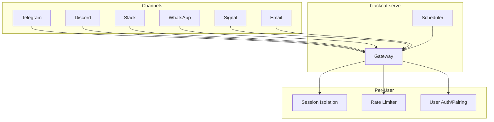

# Channel Messaging Guide

> How to connect BlackCat to messaging platforms. For configuration, see [Configuration](./configuration.md). For security, see [Security](./security.md).

## Overview

BlackCat can serve as a conversational AI bot on multiple messaging platforms simultaneously. All channels run through a unified gateway started with `blackcat serve`.



## Adapter Interface

Every channel implements the same interface (`internal/channels/channel.go`):

```go
type Adapter interface {
    Start(ctx context.Context) error
    Stop(ctx context.Context) error
    Send(ctx context.Context, msg OutgoingMessage) error
    Receive() <-chan IncomingMessage
    Platform() Platform
}
```

Supported platforms: `telegram`, `discord`, `slack`, `whatsapp`, `signal`, `email`, `cli`.

Message formats: `plain`, `markdown`, `code`.

## Setting Up Telegram

### 1. Create a Bot

1. Open Telegram and message [@BotFather](https://t.me/BotFather)
2. Send `/newbot` and follow the prompts
3. Copy the bot token (e.g., `123456:ABCdef...`)

### 2. Get Your User ID

1. Message [@userinfobot](https://t.me/userinfobot) on Telegram
2. Note your numeric user ID

### 3. Configure

```yaml
channels:
  telegram:
    enabled: true
    token: "123456:ABCdef..."    # or set TELEGRAM_BOT_TOKEN env var
    allowed_users:
      - 12345678                 # your Telegram user ID
      - 87654321                 # another authorized user
    mode: "private"              # "private" or "group"
```

### 4. Start

```bash
blackcat serve
```

### Telegram Features

- **Private mode**: Bot only responds to DMs from allowed users
- **Group mode**: Bot responds in groups where it is added (requires `/command@botname` mentions)
- Supports Markdown formatting in responses
- Per-user session isolation

## Setting Up Discord

### 1. Create a Bot

1. Go to [Discord Developer Portal](https://discord.com/developers/applications)
2. Click "New Application" and name it
3. Go to "Bot" section, click "Add Bot"
4. Copy the bot token
5. Enable "Message Content Intent" under Privileged Gateway Intents

### 2. Invite the Bot

1. Go to "OAuth2" > "URL Generator"
2. Select scopes: `bot`, `applications.commands`
3. Select permissions: `Send Messages`, `Read Message History`, `Read Messages/View Channels`
4. Open the generated URL to invite the bot to your server

### 3. Get Guild and Channel IDs

1. Enable Developer Mode in Discord (Settings > Advanced > Developer Mode)
2. Right-click your server name and "Copy ID" (guild ID)
3. Right-click the desired channel and "Copy ID" (channel ID)

### 4. Configure

```yaml
channels:
  discord:
    enabled: true
    token: "MTIzNDU2..."         # or set DISCORD_BOT_TOKEN env var
    allowed_guilds:
      - "1234567890"             # your server ID
    allowed_channels:
      - "9876543210"             # specific channel ID
```

### Discord Features

- Guild (server) and channel-level access control
- Supports Markdown formatting
- Separate message handler for commands vs. conversations
- Per-user session isolation within guilds

## Setting Up Slack

### 1. Create a Slack App

1. Go to [Slack API](https://api.slack.com/apps)
2. Click "Create New App" > "From scratch"
3. Name it and select your workspace

### 2. Configure Permissions

1. Go to "OAuth & Permissions"
2. Add Bot Token Scopes:
   - `chat:write`
   - `channels:history`
   - `channels:read`
   - `app_mentions:read`
   - `im:history`
   - `im:read`
   - `im:write`

### 3. Enable Socket Mode

1. Go to "Socket Mode"
2. Enable it and create an App-Level Token with `connections:write` scope
3. Copy the App-Level Token (`xapp-...`)

### 4. Install to Workspace

1. Go to "Install App"
2. Install to your workspace
3. Copy the Bot User OAuth Token (`xoxb-...`)

### 5. Configure

```yaml
channels:
  slack:
    enabled: true
    app_token: "xapp-..."        # App-Level Token (Socket Mode)
    bot_token: "xoxb-..."        # Bot User OAuth Token
    allowed_channels:
      - "C0123456789"            # channel IDs
```

### Slack Features

- Socket Mode (no public endpoint needed)
- Channel-level access control
- Supports Slack's `mrkdwn` formatting
- Threaded replies
- Per-user session isolation

## Setting Up WhatsApp

WhatsApp integration uses the [Baileys](https://github.com/WhiskeySockets/Baileys) library as a JavaScript bridge. BlackCat communicates with WhatsApp through a managed Node.js child process that runs the Baileys client. **WhatsApp is the only channel that requires Node.js** — all other channels (Telegram, Discord, Slack, Signal, Email) are pure Go with no external runtime dependencies.

### 1. Install Node.js (if not already installed)

Node.js is required as a runtime dependency for the WhatsApp bridge only:

```bash
# macOS
brew install node

# Ubuntu/Debian
curl -fsSL https://deb.nodesource.com/setup_22.x | sudo -E bash -
sudo apt-get install -y nodejs

# Windows
# Download from https://nodejs.org/
```

Minimum version: Node.js 18+. Verify with `node --version`.

### 2. First-Time Setup (Auto-Download + QR Pairing)

BlackCat automatically downloads and configures the Baileys bridge on first use. No manual `npm install` is needed:

1. Enable WhatsApp in your config (see step 3 below)
2. Run `blackcat serve`
3. BlackCat detects the WhatsApp channel is enabled and downloads the Baileys bridge to `~/.blackcat/whatsapp-bridge/`
4. A QR code is displayed in the terminal (or sent to another configured channel)
5. Open WhatsApp on your phone, go to **Linked Devices**, and scan the QR code
6. Once paired, the session is saved and reconnects automatically on future restarts

### 3. Configure

```yaml
channels:
  whatsapp:
    enabled: true
    session_path: "~/.blackcat/whatsapp-session"
    allowed_numbers:
      - "+1234567890"            # E.164 format
      - "+0987654321"
```

### 4. Start

```bash
blackcat serve
```

### WhatsApp Features

- End-to-end encrypted messaging (via WhatsApp protocol)
- Phone number-based access control (E.164 format)
- Session persistence across restarts (no re-scanning needed)
- Per-user session isolation
- Auto-download of Baileys bridge on first use
- Graceful reconnection on network interruption

### WhatsApp Troubleshooting

- **QR code not appearing**: Ensure Node.js is installed and in your PATH. Check `blackcat serve` logs for bridge download errors.
- **Session expired**: WhatsApp may unlink devices after 14 days of inactivity. Re-scan the QR code.
- **Node.js version error**: Ensure Node.js 18+ is installed. Run `node --version` to verify.

## Setting Up Signal

Signal integration uses the `signal-cli` tool as a bridge.

### 1. Install signal-cli

Download signal-cli from [github.com/AsamK/signal-cli](https://github.com/AsamK/signal-cli).

### 2. Register a Phone Number

Register a phone number with signal-cli:

```bash
signal-cli -u +1234567890 register
signal-cli -u +1234567890 verify <code>
```

### 3. Configure

Signal is configured via the adapter directly (not yet in `config.yaml`). The adapter uses:

| Parameter | Description |
|-----------|-------------|
| `phone_number` | Bot's registered Signal phone number |
| `allowed_numbers` | Allowed contacts (phone numbers) |
| `signal_cli_path` | Path to signal-cli binary (default: `signal-cli`) |

### Signal Features

- Phone number-based access control
- Uses signal-cli JSON-RPC mode
- End-to-end encrypted messaging (via Signal protocol)
- Per-user session isolation

> **Note**: Signal and Email channel adapters exist in `internal/channels/signal/` and `internal/channels/email/` but do not yet have config struct entries in `internal/config/config.go`. They must be configured programmatically or via environment variables. Config struct integration is planned.

## Setting Up Email

Email integration uses IMAP for receiving and SMTP for sending.

### 1. Configure Email Account

You need an email account with IMAP and SMTP access enabled (e.g., Gmail with app passwords, Outlook, or a self-hosted server).

### 2. Configure

Email is configured via the adapter directly (not yet in `config.yaml`). The adapter uses:

| Parameter | Description |
|-----------|-------------|
| `imap_host` | IMAP server hostname |
| `imap_port` | IMAP server port (default: 993) |
| `smtp_host` | SMTP server hostname |
| `smtp_port` | SMTP server port (default: 587) |
| `username` | Email username |
| `password` | Email password |
| `from_addr` | From address for outgoing emails |
| `allowed_senders` | Email addresses allowed to interact |
| `poll_interval` | How often to check for new emails |

### Email Features

- IMAP polling for incoming messages
- SMTP for sending responses
- Sender-based access control
- Per-user session isolation

## Native vs Stub Implementations

BlackCat ships with three implementation tiers for channel adapters:

| Channel | Current Status | Production Library | Migration Guide |
|---------|---------------|-------------------|-----------------|
| Telegram | **Working** (raw HTTP long-polling) | `github.com/go-telegram/bot` | [Native Guide: Telegram](./native-channels-guide.md#telegram-go-telegrambot) |
| Discord | **Stub** (no real gateway connection) | `github.com/bwmarrin/discordgo` | [Native Guide: Discord](./native-channels-guide.md#discord-discordgo) |
| Slack | **Working** (Socket Mode via raw HTTP) | `github.com/slack-go/slack` | -- |
| WhatsApp | **Stub** (no real connection) | `go.mau.fi/whatsmeow` | [Native Guide: WhatsApp](./native-channels-guide.md#whatsapp-whatsmeow) |
| Signal | **Bridge** (signal-cli subprocess) | -- | -- |
| Email | **Working** (IMAP/SMTP) | -- | -- |

**What "stub" means**: The adapter satisfies the `channels.Adapter` interface and can be registered with the Gateway, but `Start` does not establish a real connection, `Send` is a no-op, and `Receive` never emits messages. Stubs are useful for testing the gateway routing logic without real platform credentials.

**What "working" means**: The adapter performs real API communication using Go's standard library (`net/http`, `encoding/json`). It handles basic text messaging but may lack advanced features (media, embeds, webhooks) that the native libraries provide.

To upgrade a stub or raw-HTTP adapter to a native library, follow the step-by-step patterns in [docs/native-channels-guide.md](./native-channels-guide.md). Each adapter's source file contains `TODO(native)` comments that reference the specific guide sections.

## Slash Commands on Channels

Slash commands work on **all channels** — TUI, Telegram, Discord, Slack, WhatsApp, Signal, and Email. When a message starts with `/`, it is intercepted by the `InputMiddleware` (in `internal/commands/middleware.go`) **before** it reaches the LLM. This means:

- **No tokens are consumed** — slash commands never make an LLM API call
- **Instant responses** — results return immediately without waiting for model inference
- **Consistent behavior** — the same commands work identically across every channel

### How It Works

```
User sends "/status" on Telegram
  -> Telegram adapter receives message
  -> Gateway routes to InputMiddleware
  -> Middleware detects "/" prefix
  -> Command handler executes directly
  -> Result sent back through Telegram adapter
  -> LLM is never called
```

### Examples

| Channel | User Message | Result |
|---------|-------------|--------|
| Telegram | `/status` | Instant system status (model, domain, memory, plugins) |
| Discord | `/memory search auth` | Instant hybrid memory search for "auth" |
| Slack | `/cost` | Instant session cost and token usage |
| WhatsApp | `/model ollama/qwen2.5:32b` | Instant model switch confirmation |
| TUI | `/schedule list` | Instant list of all scheduled tasks |
| Email | `/help` | Instant command reference |

This saves significant tokens on routine operations. Instead of asking the LLM "how much have I spent this session?", just type `/cost` and get an instant answer.

See [Slash Commands Reference](./commands.md) for the complete list of 30+ available commands.

## Gateway Configuration

The gateway runs all enabled channels as goroutines under `blackcat serve`:

```bash
# Start the gateway (channels + scheduler)
blackcat serve
```

The gateway:
1. Loads config and identifies enabled channels
2. Starts each channel adapter as a goroutine
3. Starts the scheduler (if enabled)
4. Routes incoming messages to the agent core
5. Sends responses back through the appropriate channel

## Channel Token Security

Channel bot tokens (Telegram, Discord, Slack, WhatsApp session keys) should be stored in the encrypted secret store, not in plaintext config files:

```
/config set telegram_bot_token 123456:ABCdef...
/config set discord_bot_token MTIzNDU2...
/config set slack_app_token xapp-...
/config set slack_bot_token xoxb-...
```

When stored this way, tokens are resolved at runtime from the OS Keychain or encrypted file backend. The `config.yaml` examples in this document show the `token` field for reference — leave it empty or use an environment variable reference when using the secret store. See [Configuration: Secret Management](./configuration.md#secret-management).

All channel tokens are automatically registered with the output sanitizer at startup, so they are redacted from any tool output or LLM messages if they accidentally appear in content.

## Per-User Session Isolation

Each user on each platform gets an isolated session (`internal/channels/session.go`):

- Separate conversation history
- Separate memory context
- Separate tool execution scope
- Sessions persist across messages within a configurable timeout

This ensures that conversations between different users **do not leak information**. A message from User A never appears in User B's LLM context, and tool output from one session is never visible in another. Combined with per-user rate limiting (`internal/channels/ratelimit.go`), this prevents both cross-user data leakage and abuse.

## Rate Limiting

Per-user rate limiting (`internal/channels/ratelimit.go`) prevents abuse:

- Configurable messages-per-minute limit
- Configurable messages-per-hour limit
- Graceful error messages when limits are hit
- Separate limits per platform

## User Pairing and Authentication

The pairing system (`internal/channels/pairing.go`) controls who can interact with the bot:

### Access Control

| Platform | Control Mechanism |
|----------|------------------|
| Telegram | `allowed_users` (numeric user IDs) |
| Discord | `allowed_guilds` + `allowed_channels` |
| Slack | `allowed_channels` |
| WhatsApp | `allowed_numbers` (E.164 phone numbers) |
| Signal | `allowed_numbers` (E.164 phone numbers) |
| Email | `allowed_senders` (email addresses) |

Messages from unauthorized users are silently dropped. No error response is sent to prevent information leakage.

## Custom Channel Plugins

You can add new messaging platforms via the [plugin system](./plugins.md). A channel plugin implements the `start`, `stop`, and `send` JSON-RPC methods, and BlackCat wraps it through `ChannelBridge` to satisfy the `channels.Adapter` interface.

Example manifest:

```json
{
  "name": "acme/matrix",
  "type": "channel",
  "command": "./matrix-bridge",
  "capabilities": ["start", "stop", "send", "receive"]
}
```

## Troubleshooting

### Bot not responding

1. Check that the channel is `enabled: true` in config
2. Verify the token/API key is correct
3. Ensure your user ID is in the allowed list
4. Check `blackcat serve` logs for connection errors

### Rate limit errors

Increase the per-user rate limit or check if the user is sending too many messages.

### Session not persisting (WhatsApp)

Ensure the `session_path` directory is writable and persists across restarts.

### Discord bot not seeing messages

Verify that "Message Content Intent" is enabled in the Discord Developer Portal.
