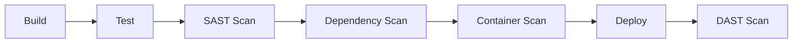

# DevSecOps Domain Guide

> BlackCat's DevSecOps domain for security scanning, vulnerability management, and CI/CD pipeline generation. For the Architect domain, see [Architect](./architect.md). For security fundamentals, see [Security](./security.md).

## Overview

The DevSecOps domain (`internal/domains/devsecops/`) provides specialized security analysis capabilities. Activate it with:

```
/domain set devsecops
```

Or let BlackCat auto-detect it based on project files:

```
/domain detect
```



```mermaid
graph TB
    subgraph "DevSecOps Domain"
        SS[Secret Scanner]
        VP[Vuln Prioritizer]
        DS[Dockerfile Scanner]
        IS[IaC Scanner]
        CS[Code Scanner]
        SB[SBOM Generator]
        PG[Pipeline Generator]
        CM[Compliance Mapper]
        RCA[RCA Reporter]
        TI[Threat Intelligence]
        SH[System Hardening]
        DP[Deployment Strategies]
    end

    subgraph "Scanners"
        SS --> F1[16 Gitleaks Rules]
        DS --> F2[CIS Benchmark]
        IS --> F3[22 Terraform+K8s Rules]
        CS --> F4[36 SAST Rules]
    end

    subgraph "Output"
        SARIF[SARIF Reports]
        CycloneDX[CycloneDX SBOM]
        Pipeline[CI/CD YAML]
        Report[HTML/Markdown Report]
    end

    SS --> SARIF
    VP --> Report
    SB --> CycloneDX
    PG --> Pipeline
```

## Scanner Architecture

All scanners implement the same interface:

```go
type Scanner interface {
    Name() string
    Description() string
    Scan(ctx context.Context, req ScanRequest) (ScanResult, error)
}
```

Findings are normalized into a common format:

```go
type Finding struct {
    ID          string
    Scanner     string
    Severity    Severity    // critical, high, medium, low, info
    Title       string
    Description string
    FilePath    string
    Line        int
    RuleID      string
    Confidence  float64     // 0.0-1.0
    Metadata    map[string]string
}
```

## Secret Scanning

The secrets scanner uses 16 Gitleaks-compatible rules to detect hardcoded secrets in source code.

### Rule Categories

| Category | Examples | Severity |
|----------|----------|----------|
| API Keys | AWS access keys, Google API keys, Stripe keys | Critical |
| Tokens | GitHub tokens, GitLab tokens, npm tokens | Critical |
| Passwords | Hardcoded passwords in config files | High |
| Private Keys | RSA/EC private keys, PGP private keys | Critical |
| Connection Strings | Database URLs with credentials | High |
| Cloud Credentials | AWS secret access keys, GCP service account keys | Critical |

### Usage

Ask BlackCat to scan for secrets:

```
Scan this repository for hardcoded secrets
```

Or use the scanner programmatically:

```go
scanner := devsecops.NewSecretsScanner()
result, err := scanner.Scan(ctx, devsecops.ScanRequest{
    Path:      "/path/to/project",
    Recursive: true,
})
```

## Vulnerability Prioritization

The vulnerability prioritizer combines multiple data sources to rank CVEs by actual risk:

### Scoring Factors

| Factor | Weight | Source |
|--------|--------|--------|
| **EPSS** | High | Exploit Prediction Scoring System (probability of exploitation) |
| **KEV** | Critical | CISA Known Exploited Vulnerabilities catalog |
| **CVSS** | Medium | Base severity score |
| **Reachability** | High | Whether the vulnerable code path is actually reachable |

### Priority Levels

| Priority | Criteria |
|----------|----------|
| P0 - Immediate | In KEV catalog OR EPSS > 0.7 AND reachable |
| P1 - High | CVSS >= 9.0 OR EPSS > 0.3 |
| P2 - Medium | CVSS >= 7.0 AND reachable |
| P3 - Low | CVSS >= 4.0 |
| P4 - Monitor | CVSS < 4.0 or unreachable |

### Usage

```
Prioritize the vulnerabilities in this project's dependencies
```

## SBOM Generation

Generates Software Bill of Materials in CycloneDX format.

### Supported Package Managers

| Language | Files Detected |
|----------|---------------|
| Go | `go.mod`, `go.sum` |
| Node.js | `package.json`, `package-lock.json`, `yarn.lock`, `pnpm-lock.yaml` |
| Python | `requirements.txt`, `Pipfile.lock`, `pyproject.toml` |
| Rust | `Cargo.toml`, `Cargo.lock` |
| Java | `pom.xml`, `build.gradle` |

### Output Format

CycloneDX JSON with:
- Component inventory (name, version, type, purl)
- Dependency graph
- License information
- Hash values (SHA-256)

### Usage

```
Generate an SBOM for this project
```

## Dockerfile Scanning

Scans Dockerfiles against CIS Docker Benchmark rules.

### Rule Categories

| Category | Examples |
|----------|----------|
| **User** | Running as root, no USER directive |
| **Image** | Using `latest` tag, untrusted base images |
| **Secrets** | COPY of `.env` files, ARG with secrets |
| **Network** | Exposing unnecessary ports |
| **Build** | No health check, no .dockerignore |
| **Layers** | Excessive layers, apt cache not cleaned |

### Usage

```
Scan the Dockerfile for security issues
```

## IaC Scanning

Scans Infrastructure-as-Code files for security misconfigurations.

### Terraform Rules (12 rules)

| Category | Examples |
|----------|----------|
| Encryption | S3 without encryption, RDS without encryption at rest |
| Access | Public S3 buckets, overly permissive IAM policies |
| Logging | CloudTrail disabled, VPC flow logs missing |
| Networking | Security groups with 0.0.0.0/0, public subnets |

### Kubernetes Rules (10 rules)

| Category | Examples |
|----------|----------|
| Pod Security | Privileged containers, running as root |
| Resources | No resource limits, no requests |
| Networking | No network policies, host networking |
| RBAC | Wildcard permissions, cluster-admin binding |

### Usage

```
Scan our Terraform files for security issues
Scan our Kubernetes manifests for misconfigurations
```

## Code Scanning (SAST)

Static Application Security Testing with 36 rules across multiple languages.

### Rule Categories

| Category | Languages | Examples |
|----------|-----------|----------|
| Injection | Go, Python, JS | SQL injection, command injection, XSS |
| Crypto | All | Weak algorithms, hardcoded keys, insecure random |
| Auth | All | Missing auth checks, session management flaws |
| Data | All | Sensitive data exposure, logging secrets |
| Error Handling | Go, Python | Missing error checks, empty catch blocks |
| File I/O | All | Path traversal, insecure file permissions |

### Usage

```
Run a SAST scan on the codebase
Scan for SQL injection vulnerabilities
```

## Pipeline Generation

Generates CI/CD pipeline configurations with security hardening.

### Supported CI Systems

| CI System | Output Format |
|-----------|---------------|
| GitHub Actions | `.github/workflows/*.yaml` |
| GitLab CI | `.gitlab-ci.yml` |
| Jenkins | `Jenkinsfile` |

### Pipeline Stages



### Security Hardening

Generated pipelines include:
- Secret scanning as a pre-commit hook
- Dependency vulnerability checking
- Container image scanning
- Least-privilege service accounts
- Artifact signing
- Branch protection enforcement

### Usage

```
Generate a GitHub Actions pipeline with security scanning
Create a GitLab CI pipeline for this Go project
```

## Compliance Mapping

Maps findings to compliance framework controls.

### Supported Frameworks (6)

| Framework | Coverage |
|-----------|----------|
| SOC 2 | Type I and Type II controls |
| PCI DSS | v4.0 requirements |
| HIPAA | Technical safeguards |
| ISO 27001 | Annex A controls |
| NIST CSF | Core functions and categories |
| CIS Controls | v8 implementation groups |

### Usage

```
Map our security findings to SOC 2 controls
Generate a compliance report for PCI DSS
```

## RCA Reporting

Root Cause Analysis reporting for security incidents.

### Report Structure

1. **Executive Summary** -- What happened, impact, status
2. **Timeline** -- Chronological event reconstruction
3. **Root Cause** -- Technical analysis of the failure
4. **Contributing Factors** -- What enabled the incident
5. **Remediation** -- Steps taken and planned
6. **Lessons Learned** -- Process improvements
7. **Action Items** -- Assigned follow-ups with deadlines

### Usage

```
Generate an RCA report for the API key exposure incident
```

## Threat Intelligence

Integration with threat intelligence feeds for enriching findings.

### Data Sources

| Source | Data Type |
|--------|-----------|
| CISA KEV | Known exploited vulnerabilities |
| EPSS | Exploit probability scores |
| NVD | CVE details and CVSS scores |
| GitHub Advisory | Language-specific advisories |

### Usage

```
Check if any of our dependencies have known exploits
Enrich our vulnerability scan with threat intelligence
```

## SARIF Output

All scanners can output findings in SARIF (Static Analysis Results Interchange Format) for integration with:
- GitHub Code Scanning
- Azure DevOps
- VS Code SARIF Viewer
- Any SARIF-compatible tool

## System Hardening (SysAdmin)

The system hardening module (`internal/domains/devsecops/sysadmin.go`) provides CIS Benchmark-based hardening rules for Linux systems.

### Rule Categories

| Category | Examples |
|----------|----------|
| **SSH** | Disable root login, disable password auth, set max auth tries, protocol version 2 |
| **Network** | Firewall rules, IP forwarding, ICMP redirects |
| **Filesystem** | Permissions on sensitive files, mount options |
| **Access** | Password policies, account lockout |
| **Audit** | Audit logging, log rotation |
| **Services** | Disable unnecessary services |
| **Kernel** | Kernel parameter hardening (sysctl) |

Each rule includes a CIS Benchmark reference, a check command, and a remediation command.

### Usage

```
Harden this Linux server according to CIS benchmarks
Check SSH configuration for security issues
```

## Deployment Strategies

The deployment module (`internal/domains/devsecops/deployment.go`) helps choose and implement deployment strategies.

### Supported Strategies

| Strategy | Zero Downtime | Rollback Speed | Resource Overhead |
|----------|:------------:|:--------------:|:-----------------:|
| **Blue-Green** | Yes | Instant | 2x |
| **Canary** | Yes | Fast | 1.1x |
| **Rolling** | Yes | Slow | 1x |
| **Recreate** | No | N/A | 1x |

The module scores strategies based on requirements (zero-downtime needs, rollback speed, resource budget, compliance level) and generates Kubernetes manifest snippets.

### Docker Compose Generation

The deployment module can also generate Docker Compose configurations from service definitions.

### Usage

```
Recommend a deployment strategy for our payment service
Generate a blue-green deployment manifest for Kubernetes
```

## Aggregated Reporting

The findings aggregator (`internal/domains/devsecops/aggregator.go`) combines results from all scanners into a unified report:

```
Run a full security assessment of this project
```

Output includes:
- Findings grouped by severity
- Scanner-by-scanner breakdown
- Trend analysis (if historical data available)
- Prioritized remediation roadmap

## DevSecOps Workflows

The workflows module (`internal/domains/devsecops/workflows.go`) provides 10 pre-built security workflows:

| Workflow | Description |
|----------|-------------|
| `pre-commit-security` | Secret scan + SAST + dependency check before committing |
| `dependency-audit` | Full dependency audit with vulnerability prioritization |
| `container-hardening` | Dockerfile + image scanning and hardening |
| `k8s-security-review` | Kubernetes manifest security review (CIS + PSS) |
| `iac-security-review` | Terraform/CloudFormation/K8s IaC scanning |
| `incident-triage` | Triage security incidents using threat intelligence |
| `compliance-gap-analysis` | Analyze compliance gaps against frameworks |
| `sbom-pipeline` | Generate and analyze Software Bill of Materials |
| `threat-model` | Systematic STRIDE threat modeling |
| `pentest-assist` | Guided penetration testing (OWASP WSTG) |

Each workflow defines a trigger pattern, ordered steps with tool invocations, and output tags.

### Security Posture Report

The reporting module (`internal/domains/devsecops/reporting.go`) generates an overall security posture report with:

- **Overall score** (0-100) and risk level (critical/high/medium/low)
- **Per-section scores** with finding counts by severity
- **Recommendations** for improving the security posture
