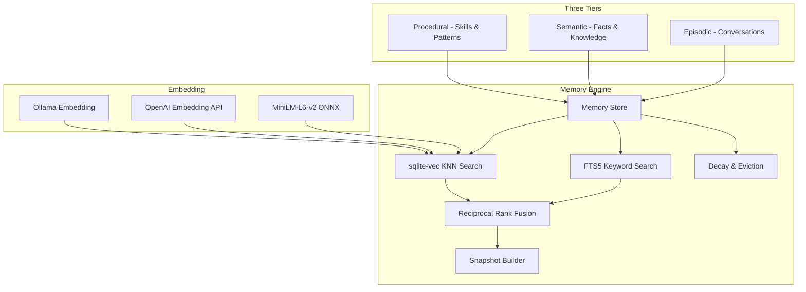
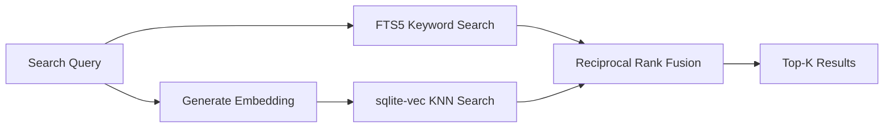

# Memory System

> Deep dive into BlackCat's vector memory system. For architecture context, see [Architecture](./architecture.md). For configuration, see [Configuration](./configuration.md).

## Overview

BlackCat uses a three-tier memory system stored in a single SQLite database with the sqlite-vec extension. Memory is vector-based, not file-based, which enables semantic retrieval and intelligent context injection.



## Three Memory Tiers

### Episodic Memory

Stores conversation history and past interactions.

| Attribute | Value |
|-----------|-------|
| Tier constant | `TierEpisodic` |
| What gets stored | User messages, agent responses, tool call results |
| Typical lifespan | 30 days (configurable `retention_days`) |
| Use case | Recalling past conversations, maintaining context across sessions |

Example entry:
```json
{
  "id": "ep-2024-01-15-001",
  "tier": "episodic",
  "content": "User asked about deploying to Kubernetes. Discussed Helm charts and ArgoCD.",
  "metadata": {"session_id": "abc123", "topic": "kubernetes"},
  "score": 0.95,
  "user_id": "user-456"
}
```

### Semantic Memory

Stores learned facts, project knowledge, and domain information.

| Attribute | Value |
|-----------|-------|
| Tier constant | `TierSemantic` |
| What gets stored | Project facts, user preferences, domain knowledge |
| Typical lifespan | Long-lived (higher decay resistance) |
| Use case | "The project uses PostgreSQL 15", "User prefers Go over Python" |

### Procedural Memory

Stores reusable skills and procedures.

| Attribute | Value |
|-----------|-------|
| Tier constant | `TierProcedural` |
| What gets stored | Learned workflows, tool usage patterns, successful approaches |
| Typical lifespan | Permanent (unless explicitly deleted) |
| Use case | "To deploy, run make build then kubectl apply" |

See [Skills](./skills.md) for the skill marketplace system built on procedural memory.

## Storage Architecture

### Single Database Design

All memory is stored in `~/.blackcat/memory.db`, a single SQLite database with two key extensions:

- **FTS5**: Full-text search virtual table for keyword retrieval
- **sqlite-vec**: Vector storage and KNN search for semantic retrieval

### Schema

The database contains:

| Table | Purpose |
|-------|---------|
| `memories` | Core memory entries (id, tier, content, metadata, score, timestamps) |
| `memory_fts` | FTS5 virtual table indexed on content |
| `memory_vectors` | sqlite-vec table storing 384-dimension int8 vectors |

### Memory Entry

```go
type Entry struct {
    ID        string            // unique identifier
    Tier      Tier              // "episodic", "semantic", "procedural"
    Content   string            // the actual text
    Metadata  map[string]string // arbitrary key-value pairs
    Score     float64           // relevance/decay score
    CreatedAt int64             // unix timestamp
    UpdatedAt int64             // unix timestamp
    UserID    string            // for channel-scoped sessions
}
```

## Engine Interface

The memory engine exposes these operations:

```go
type Engine interface {
    Store(ctx context.Context, entry Entry) error
    Search(ctx context.Context, query SearchQuery) ([]SearchResult, error)
    Delete(ctx context.Context, id string) error
    BuildSnapshot(ctx context.Context, projectID, userID string) (Snapshot, error)
    Decay(ctx context.Context) (int, error)
    Stats(ctx context.Context) (Stats, error)
    Close() error
}
```

## Hybrid Retrieval

BlackCat combines two search strategies and merges results with Reciprocal Rank Fusion (RRF).



### FTS5 Keyword Search

Full-text search using SQLite's FTS5 extension:

1. Query terms are wrapped in quotes and joined with `OR`
2. The FTS5 virtual table is searched with `MATCH`
3. Results are ranked by FTS5's built-in BM25 scoring
4. Returns 3x the requested limit as candidates

```sql
SELECT m.* FROM memory_fts f
JOIN memories m ON m.rowid = f.rowid
WHERE memory_fts MATCH '"term1" OR "term2"'
ORDER BY rank
LIMIT ?
```

### Vector KNN Search

Semantic search using sqlite-vec:

1. Query text is embedded using the configured embedder (bundled ONNX, OpenAI, or Ollama)
2. The embedding is passed to `SearchKNN` which finds the nearest neighbors
3. Returns 3x the requested limit as candidates

### Reciprocal Rank Fusion (RRF)

The two result sets are merged using RRF with k=60 (standard value):

```
RRF_score(doc) = 1/(k + rank_fts) + 1/(k + rank_vec)
```

Where:
- `k = 60` (smoothing constant)
- `rank_fts` = position in FTS5 results (1-indexed), absent = no contribution
- `rank_vec` = position in vector results (1-indexed), absent = no contribution

The final score is normalized to [0, 1] by dividing by the maximum possible score (rank 1 in both lists).

### Why Hybrid?

| Strategy | Strength | Weakness |
|----------|----------|----------|
| FTS5 only | Exact keyword match, fast | Misses semantic similarity |
| Vector only | Semantic understanding | Misses exact terms, jargon |
| Hybrid (RRF) | Best of both | Slightly more compute |

## Embedding

### Bundled ONNX Model (Default)

BlackCat embeds the MiniLM-L6-v2 model directly in the binary via `go:embed`:

| Property | Value |
|----------|-------|
| Model | `all-MiniLM-L6-v2` |
| Format | ONNX (int8 quantized) |
| Dimensions | 384 |
| Binary size | ~25 MB embedded |
| Inference | Via ONNX Runtime (CGo) |
| Latency | < 5ms per embedding |

No download on first use. The model is always available.

### Alternative Embedders

```yaml
memory:
  embedding: "openai"    # use OpenAI text-embedding-3-small
  # or
  embedding: "ollama"    # use Ollama nomic-embed-text
```

The embedder interface:

```go
type Embedder interface {
    Embed(ctx context.Context, text string) ([]float32, error)
    EmbedBatch(ctx context.Context, texts []string) ([][]float32, error)
    Dimensions() int
}
```

## Memory Snapshot

At session start, BlackCat builds a memory snapshot -- a compressed context injected into the system prompt:

```go
type Snapshot struct {
    Content    string // compiled text (~800 tokens)
    TokenCount int
    EntryCount int
}
```

The snapshot is built by:
1. Searching memory for relevant entries (project-scoped, user-scoped)
2. Ranking by relevance and recency
3. Compiling into a text block within a token budget (~800 tokens)
4. Injecting as a context layer in the [Context Assembler](./architecture.md#context-assembly)

## Decay and Eviction

### Time-Weighted Decay

The `Decay` operation runs periodically (or on demand via `/memory decay`):

1. Entries older than `retention_days` begin losing score
2. Score decays proportionally to age beyond retention
3. Entries below a minimum score threshold are evicted
4. Returns the count of evicted entries

### Budget Enforcement

When the vector count exceeds `max_vectors` (default: 10,000):

1. Entries with the lowest scores are evicted first
2. Episodic entries decay faster than semantic entries
3. Procedural entries are most resistant to decay
4. The budget is a hard cap on total vectors stored

### Performance Target

| Metric | Target |
|--------|--------|
| Vector search latency | < 10ms at 10K vectors |
| Memory budget | 10K vectors (int8, 384 dimensions) |
| Database size | ~50-100 MB at full capacity |

## Memory CLI Commands

### Search Memory

```
/memory search <query>
```

Performs a hybrid search and returns ranked results.

### View Statistics

```
/memory stats
```

Shows:
```
Memory stats:
  Episodic: 1,234
  Semantic: 567
  Procedural: 89
  Total vectors: 1,890
  DB size: 45.2 MB
```

### List Recent Memories

```
/memory list              # all tiers
/memory list episodic     # specific tier
/memory list semantic
/memory list procedural
```

### Delete a Memory

```
/memory forget <id>
```

### Export Memories

```
/memory export
```

Exports all memories as JSON for backup or migration.

## Session Search

BlackCat can search across past session transcripts using FTS5 (`internal/agent/session_search.go`):

- Results are grouped by session
- Supports full-text query syntax
- Useful for "What did we discuss about X?" queries

## Configuration Reference

```yaml
memory:
  enabled: true           # enable/disable memory system
  max_vectors: 10000      # maximum vectors before eviction
  embedding: "local"      # "local" (ONNX), "openai", or "ollama"
  retention_days: 30      # days before decay begins
  db_path: ""             # default: ~/.blackcat/memory.db
```

## Secret Sanitization in Memory

Before any content is stored in the memory database, it passes through the output sanitization pipeline with `TargetMemory` mode (`internal/security/secrets/sanitizer.go`). This ensures that API keys, tokens, passwords, and other secrets from tool output or conversation history are redacted before being persisted. This prevents future LLM exposure when memory entries are retrieved and injected into the system prompt via the Context Assembler.

The sanitization layers applied to memory entries are:
1. Registered secret value redaction
2. Regex pattern detection (12 secret patterns)
3. Connection string password scrubbing

See [Security: Output Sanitization](./security.md#output-sanitization) for the full pipeline.

## Architecture Decisions

**Why SQLite?** Single-file database, no external dependencies, excellent for embedded use. Combined with sqlite-vec, it provides both relational storage and vector search in one file.

**Why bundled embedding?** Zero-setup experience. No API key needed for basic memory functionality. Users can upgrade to cloud embeddings for better quality.

**Why hybrid search?** Pure vector search misses exact terms (API names, error codes). Pure keyword search misses semantic similarity. RRF combines both with no tuning required.

**Why int8 quantization?** Reduces memory footprint by 4x (384 x 1 byte vs. 384 x 4 bytes) with minimal quality loss for MiniLM-scale models.
