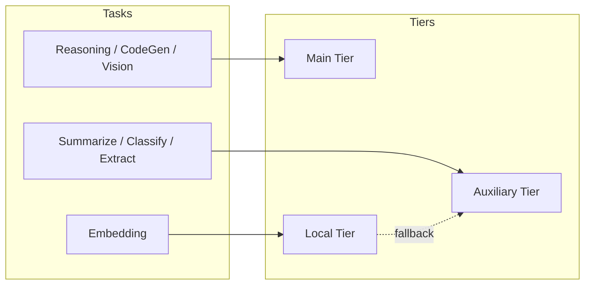

# LLM Providers

> Guide to configuring and using LLM providers with BlackCat. For general configuration, see [Configuration](./configuration.md). For architecture context, see [Architecture](./architecture.md).

## Provider Overview

BlackCat supports 8 LLM providers through the unified `Provider` interface:

| Provider | Type | Streaming | Vision | Embedding | Cost Tracking |
|----------|------|-----------|--------|-----------|---------------|
| Anthropic | Cloud | Yes | Yes | No | Yes |
| OpenAI | Cloud | Yes | Yes | Yes | Yes |
| Ollama | Local | Yes | Varies | Yes | Free |
| OpenRouter | Cloud | Yes | Varies | No | Yes |
| Groq | Cloud | Yes | No | No | Yes |
| ZAI | Cloud | Yes | No | No | Yes |
| Kimi | Cloud | Yes | No | No | Yes |
| xAI | Cloud | Yes | No | No | Yes |

## Model Naming Format

BlackCat uses the `provider/model` naming convention:

| Format | Example | When to Use |
|--------|---------|-------------|
| `model-id` | `claude-sonnet-4-6` | Direct provider (Anthropic, OpenAI) |
| `provider/model` | `anthropic/claude-sonnet-4-6` | Explicit provider selection |
| `openrouter/provider/model` | `openrouter/anthropic/claude-opus-4-6` | Route through OpenRouter |

### Examples

```yaml
# Direct Anthropic
model: "claude-sonnet-4-6"

# Explicit provider
model: "anthropic/claude-sonnet-4-6"

# Via OpenRouter (access any model with one API key)
model: "openrouter/anthropic/claude-opus-4-6"
model: "openrouter/openai/gpt-5.4"
model: "openrouter/google/gemini-2.5-pro"
model: "openrouter/deepseek/deepseek-chat"
model: "openrouter/meta-llama/llama-4-maverick"

# Local via Ollama
model: "ollama/qwen2.5:72b"
model: "ollama/deepseek-r1:14b"
model: "ollama/llama3.3:70b"
```

Users can set the model in config or override per-session:

```
/model anthropic/claude-opus-4-6
/model openrouter/google/gemini-2.5-pro
/model ollama/qwen2.5:72b
```

## Provider Interface

Every provider implements this interface (defined in `internal/llm/provider.go`):

```go
type Provider interface {
    Chat(ctx context.Context, req ChatRequest) (ChatResponse, error)
    Stream(ctx context.Context, req ChatRequest) (<-chan StreamChunk, error)
    Models() []ModelInfo
    Name() string
}
```

## API Key Security

**API keys are never stored in plaintext config files.** BlackCat stores all provider API keys in an encrypted secret store (OS Keychain or XChaCha20-Poly1305 encrypted file). The recommended way to set API keys is:

```
/config set <provider>_api_key <value>
```

This stores the key in the encrypted backend. The key is resolved at runtime for LLM API calls and is automatically redacted from all tool output, memory entries, and LLM messages by the 5-layer sanitization pipeline. See [Configuration: Secret Management](./configuration.md#secret-management) for full details.

Environment variables (`ANTHROPIC_API_KEY`, etc.) are supported as a fallback, especially for CI/CD and containerized environments. The `api_key` field in `config.yaml` is accepted for backward compatibility but **not recommended** — it stores the key in plaintext on disk.

## Setup by Provider

### Anthropic (Recommended)

BlackCat is optimized for Anthropic Claude models, with prompt caching and extended thinking support.

**1. Get an API key** from [console.anthropic.com](https://console.anthropic.com)

**2. Configure (recommended — encrypted store):**

```
/config set anthropic_api_key sk-ant-api03-...
```

Or via environment variable:

```bash
export ANTHROPIC_API_KEY="sk-ant-api03-..."
```

Optional model restrictions in `~/.blackcat/config.yaml`:

```yaml
providers:
  anthropic:
    api_key: ""   # leave empty when using secret store or env var
    models:
      - claude-opus-4-6        # Flagship — deepest reasoning, best quality
      - claude-sonnet-4-6      # Best value — excellent coding, fast
      - claude-haiku-4-5       # Fast & cheap — sub-agents, classification
```

**3. Recommended model routing:**

| Tier | Model | Use Case |
|------|-------|----------|
| Main | `claude-sonnet-4-6` | Reasoning, code generation, vision |
| Auxiliary | `claude-haiku-4-5` | Summarization, classification, sub-agents |
| Deep reasoning | `claude-opus-4-6` | Complex architecture, research, analysis |

**Prompt caching**: BlackCat automatically applies the `system_and_3` caching strategy, placing cache breakpoints on the system message and the last 3 conversation messages. This can reduce costs by 50-90% on long sessions.

### OpenAI

**1. Get an API key** from [platform.openai.com](https://platform.openai.com)

**2. Configure:**

```
/config set openai_api_key sk-...
```

Or via environment variable:

```bash
export OPENAI_API_KEY="sk-..."
```

Optional model restrictions:

```yaml
providers:
  openai:
    api_key: ""   # leave empty when using secret store or env var
    models:
      - gpt-5.4           # Flagship — most capable
      - gpt-4.1           # 1M context, best for coding
      - gpt-4.1-mini      # Cheap — good balance of cost and quality
      - gpt-4.1-nano      # Cheapest — lightweight tasks
      - o4-mini           # Reasoning — chain-of-thought
      - o3                # Deep reasoning — complex analysis
```

**3. Model routing:**

| Tier | Model | Use Case |
|------|-------|----------|
| Main | `gpt-4.1` | 1M context, best for coding tasks |
| Auxiliary | `gpt-4.1-mini` | Cheap, good for sub-agents and summarization |
| Flagship | `gpt-5.4` | Most capable, complex reasoning |
| Reasoning | `o4-mini` / `o3` | Chain-of-thought, deep analysis |

### Ollama (Local / Air-Gapped)

Ollama runs models locally. Ideal for air-gapped environments or embedding.

**1. Install Ollama:**

```bash
# macOS / Linux
curl -fsSL https://ollama.com/install.sh | sh

# Windows
# Download from https://ollama.com/download
```

**2. Pull models:**

```bash
# Recommended: Qwen 2.5 (best open-source for coding)
ollama pull qwen2.5:72b          # Best quality (requires 48GB+ RAM)
ollama pull qwen2.5:32b          # Good balance (requires 24GB+ RAM)
ollama pull qwen2.5:7b           # Fast & lightweight

# Alternative: DeepSeek (strong reasoning)
ollama pull deepseek-r1:14b

# Alternative: Llama 4 (Meta's latest)
ollama pull llama4-scout:17b

# Embedding
ollama pull nomic-embed-text
```

**3. Configure:**

```yaml
providers:
  ollama:
    base_url: "http://localhost:11434"

# Recommended Ollama setup
model: "ollama/qwen2.5:32b"              # Main
agent:
  sub_agent_model: "ollama/qwen2.5:7b"   # Auxiliary (cheap)
memory:
  embedding: "ollama"                      # Use Ollama for embeddings
```

**4. Verify Ollama is running:**

```bash
ollama list    # should show pulled models
curl http://localhost:11434/api/tags   # API health check
```

### OpenRouter

OpenRouter provides access to 100+ models from multiple providers through a single API.

**1. Get an API key** from [openrouter.ai](https://openrouter.ai)

**2. Configure:**

```
/config set openrouter_api_key sk-or-...
```

Or via environment variable:

```bash
export OPENROUTER_API_KEY="sk-or-..."
```

OpenRouter supports dynamic model fetching, so you do not need to specify models explicitly.

**3. Model examples** (use the `openrouter/provider/model` format):

```yaml
# Access any model with one API key
model: "openrouter/anthropic/claude-opus-4-6"    # Anthropic via OpenRouter
model: "openrouter/openai/gpt-5.4"               # OpenAI via OpenRouter
model: "openrouter/google/gemini-2.5-pro"         # Google via OpenRouter
model: "openrouter/deepseek/deepseek-chat"        # DeepSeek via OpenRouter
model: "openrouter/meta-llama/llama-4-maverick"   # Meta via OpenRouter
model: "openrouter/moonshotai/kimi-k2.5"          # Kimi via OpenRouter
```

### Groq

Ultra-fast inference for open-source models. Also provides the Whisper API for voice transcription.

**1. Get an API key** from [console.groq.com](https://console.groq.com)

**2. Configure:**

```bash
# Available on Groq (ultra-fast inference)
# Chat: llama-4-scout-17b, llama-3.3-70b-versatile, deepseek-r1-distill-llama-70b
# Voice: whisper-large-v3-turbo (FREE)
export GROQ_API_KEY="gsk_..."
```

Groq is also used for voice transcription via the `transcribe_audio` tool (Whisper Large V3 Turbo model, free). No additional configuration is needed beyond setting the API key.

> **Note**: Groq, ZAI, Kimi, and xAI providers use environment variables for API keys. They do not have dedicated entries in the `providers` section of `config.yaml`.

### ZAI (Z.ai / GLM)

Models: `glm-5` (745B MoE, flagship), `glm-5-turbo` (agent-optimized), `glm-4.7-flash` (FREE).

```bash
export ZAI_API_KEY="..."
```

### Kimi (Moonshot)

Models: `kimi-k2.5` (256K context, agent swarm capable), `kimi-k2.5-mini`.

```bash
export KIMI_API_KEY="..."
```

### xAI (Grok)

Models: `grok-4-1-fast-latest` (flagship), `grok-4-heavy` (deep reasoning), `grok-code-fast-1` (coding), `grok-3-mini` (cheap).

```bash
export XAI_API_KEY="xai-..."
```

## Model Router Configuration

The model router maps task types to three tiers of providers:



### Default Task Routing

| Task | Tier | Default Provider |
|------|------|-----------------|
| `TaskReasoning` | Main | Anthropic Claude Sonnet |
| `TaskCodeGen` | Main | Anthropic Claude Sonnet |
| `TaskVision` | Main | Anthropic Claude Sonnet |
| `TaskSummarize` | Auxiliary | Anthropic Claude Haiku |
| `TaskClassify` | Auxiliary | Anthropic Claude Haiku |
| `TaskExtractFacts` | Auxiliary | Anthropic Claude Haiku |
| `TaskMemorySearch` | Auxiliary | Anthropic Claude Haiku |
| `TaskDangerAssess` | Auxiliary | Anthropic Claude Haiku |
| `TaskCompression` | Auxiliary | Anthropic Claude Haiku |
| `TaskEmbed` | Local | Bundled ONNX MiniLM |

### Overriding the Router

Per-task overrides take precedence over the default tier mapping. The router checks: explicit override first, then the default tier.

## Dynamic Model Fetching

BlackCat can dynamically fetch available models from each provider at startup. This is handled by `internal/llm/model_fetcher.go` and ensures the model list stays current without requiring config updates.

For providers that support it:
- **Anthropic**: Fetches via API
- **OpenAI**: Fetches via `/v1/models`
- **Ollama**: Fetches via `/api/tags`
- **OpenRouter**: Fetches via `/api/v1/models`

## DynamicProvider Wrapper

The `DynamicProvider` (`internal/llm/model_fetcher.go`) wraps any `Provider` and overrides its `Models()` method with API-fetched model lists. This ensures model availability stays current without config updates. It delegates `Chat()`, `Stream()`, and `Name()` to the inner provider, but fetches model lists dynamically via the appropriate API endpoint (with caching and fallback to the inner provider's static list on error).

## Cost Tracking

Every API call is tracked with token counts and estimated USD cost:

```go
type CostEntry struct {
    Model            string
    PromptTokens     int
    CompletionTokens int
    Cost             float64   // USD
}
```

Use the `/cost` slash command to see session spending:

```
/cost
```

Output:
```
Session cost: $0.12 | Tokens: 15,420 in / 3,210 out | Calls: 8
```

### Budget Limits

The cost tracker supports optional budget limits:
- **Budget**: Maximum USD per session (0 = unlimited)
- **Warning threshold**: Alert when spending exceeds this amount

When the budget is exceeded, `IsOverBudget()` returns true and the agent can take corrective action (e.g., switch to cheaper models).

## Provider Comparison Matrix

| Feature | Anthropic | OpenAI | Ollama | OpenRouter | Groq | ZAI | Kimi | xAI |
|---------|-----------|--------|--------|------------|------|-----|------|-----|
| **Best for** | Main reasoning | Alternative main | Local/private | Model variety | Speed | Chinese LLM | Chinese LLM | Grok models |
| **Prompt caching** | Yes | No | No | Varies | No | No | No | No |
| **Extended thinking** | Yes | Yes (o3) | No | Varies | No | No | No | No |
| **Vision** | Yes | Yes | Some | Varies | No | No | No | No |
| **Embedding** | No | Yes | Yes | No | No | No | No | No |
| **Voice (Whisper)** | No | No | No | No | Yes | No | No | No |
| **Local/air-gap** | No | No | Yes | No | No | No | No | No |
| **Latency** | ~1-3s | ~1-3s | ~2-10s | ~2-5s | ~0.5-2s | ~1-3s | ~1-3s | ~1-3s |

*Costs vary by model and change frequently. Check provider pricing pages for current rates.*

## Switching Models at Runtime

Use the `/model` slash command to switch models during a session:

```
/model anthropic/claude-opus-4-6    # switch to Opus for deep reasoning
/model ollama/qwen2.5:32b           # switch to local model
/model openrouter/google/gemini-2.5-pro  # switch via OpenRouter
/model                              # show current model
```

## Plugin Providers

Third-party LLM providers can be added via the [plugin system](./plugins.md). A provider plugin implements the JSON-RPC `chat`, `stream`, and `models` methods, and BlackCat wraps it through `ProviderBridge` to satisfy the `llm.Provider` interface.

See [Plugins: Creating a Provider Plugin](./plugins.md#creating-a-provider-plugin) for a step-by-step guide.
