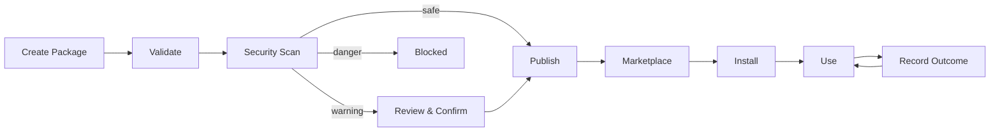

# Skill Marketplace Guide

> How to install, create, and publish skills for BlackCat. For plugin development (different from skills), see [Plugins](./plugins.md). For security scanning details, see [Security](./security.md).

## What Are Skills?

Skills are reusable, portable procedures that teach BlackCat how to perform specific tasks. They are JSON packages containing step-by-step instructions, tool requirements, and prompts.

Skills differ from plugins:
- **Skills** are declarative JSON packages describing *what to do*
- **Plugins** are executable binaries extending *how BlackCat works*

## Skill Package Format

A skill package is a JSON file with the following structure:

```json
{
  "api_version": "1.0.0",
  "kind": "skill",
  "metadata": {
    "name": "devsecops/secret-scanner",
    "version": "1.2.0",
    "author": "MeowAI",
    "description": "Scan a repository for hardcoded secrets using Gitleaks rules and entropy detection",
    "license": "MIT",
    "tags": ["security", "devsecops", "secrets"],
    "repository": "https://github.com/meowai/skills",
    "homepage": "https://blackcat.dev/skills/secret-scanner",
    "min_version": "0.1.0"
  },
  "spec": {
    "trigger": "scan * for secrets",
    "steps": [
      {
        "name": "discover-files",
        "tool": "search_files",
        "description": "Find all source code files in the target directory",
        "command": ""
      },
      {
        "name": "scan-patterns",
        "tool": "scan_secrets",
        "description": "Run Gitleaks regex patterns against discovered files",
        "prompt": "Scan each file for hardcoded API keys, tokens, passwords, and private keys"
      },
      {
        "name": "entropy-check",
        "description": "Check high-entropy strings that might be secrets",
        "prompt": "For any string with Shannon entropy > 4.5 and length > 20, flag as potential secret"
      },
      {
        "name": "report",
        "description": "Generate a findings report grouped by severity",
        "prompt": "Summarize all findings: critical (API keys, private keys), high (tokens, passwords), medium (potential secrets by entropy)"
      }
    ],
    "tools": ["search_files", "read_file", "scan_secrets"],
    "env": {},
    "prompts": {
      "system_context": "You are a security expert performing secret detection."
    }
  }
}
```

### Metadata Fields

| Field | Required | Description |
|-------|----------|-------------|
| `name` | Yes | Unique ID in `category/name` format |
| `version` | Yes | Semantic version (major.minor.patch) |
| `author` | Yes | Author name |
| `description` | Yes | Description (minimum 10 characters) |
| `license` | Yes | SPDX license identifier |
| `tags` | No | Searchable tags |
| `repository` | No | Source repository URL |
| `homepage` | No | Documentation URL |
| `min_version` | No | Minimum BlackCat version required |

### Spec Fields

| Field | Description |
|-------|-------------|
| `trigger` | Glob pattern for matching user tasks (e.g., `scan * for secrets`) |
| `steps` | Ordered list of execution steps |
| `tools` | Required tool names |
| `env` | Environment variables to set during execution |
| `prompts` | Named prompt templates |

### Step Fields

| Field | Description |
|-------|-------------|
| `name` | Step identifier |
| `tool` | Tool to invoke (optional) |
| `command` | Shell command to run (optional) |
| `prompt` | LLM prompt for this step (optional) |
| `description` | Human-readable description |

## Installing Skills

### From the Marketplace

```
/skills search secret scanner
/skills install devsecops/secret-scanner
```

### From a Local File

```
/skills install /path/to/skill-package.json
```

### From a URL

```
/skills install https://example.com/skills/secret-scanner.json
```

## Managing Skills

```
/skills list                    # list all installed skills
/skills update                  # update all skills to latest versions
/skills uninstall <name>        # remove a skill
```

## Using Skills

Skills are automatically matched when the user's request matches the skill's trigger pattern. You can also invoke them explicitly:

```
# Automatic matching
> Scan this project for secrets

# Skills can also surface as slash commands if configured
/skills list
```

## Creating a Skill

### Step 1: Define the Package

Create a JSON file following the [package format](#skill-package-format).

### Step 2: Validate

```go
pkg, err := skills.ParseSkillPackage(data)
if err != nil {
    // handle parse error
}
if err := pkg.Validate(); err != nil {
    // handle validation error
}
```

Validation checks:
- `api_version` is present
- `name` is in `category/name` format
- `version` is valid semver (major.minor.patch)
- `author` is present
- `description` is at least 10 characters
- `license` is present
- At least 1 step is defined

### Step 3: Security Scan

Before publishing, run the security scanner:

```go
scanner := skills.NewSkillScanner()
result := scanner.ScanPackage(pkg)
// result.Verdict: "safe", "warning", or "danger"
// result.Score: 0-100
// result.Threats: []SkillThreat
```

See [Security: Skill Security Scanning](./security.md#skill-security-scanning) for the full list of 30+ threat patterns.

### Step 4: Test Locally

Install the skill locally and test it:

```
/skills install ./my-skill.json
```

### Step 5: Publish

```go
// Programmatic publishing
publisher := skills.NewPublisher(marketplaceURL)
err := publisher.Publish(ctx, pkg)
```

## Security Scanning

Every skill is scanned before installation. The scanner checks both command steps and prompt steps for threats:

### Verdict Levels

| Score | Verdict | Action |
|-------|---------|--------|
| >= 70 | `safe` | Installed without warning |
| 40-69 | `warning` | User must review and confirm |
| < 40 | `danger` | Installation blocked |

### What Gets Scanned

**Commands** are checked for:
- Destructive operations (`rm -rf`, `dd`, `mkfs`)
- Privilege escalation (`sudo`, `su root`)
- Data exfiltration (`curl POST` with auth headers)
- Credential theft (reading `/etc/shadow`, `GITHUB_TOKEN`)
- Network access (`curl`, `wget`)
- Obfuscation (`base64 decode + eval`, `nohup`)

**Prompts** are checked for:
- Prompt injection ("ignore previous instructions")
- Role hijacking ("you are now...", "act as...")
- Deception ("do not tell the user")
- Data exfiltration via LLM ("send to https://...")
- Obfuscation (base64 content)

### Severity Scoring

| Severity | Points Deducted |
|----------|----------------|
| Critical | -40 |
| High | -20 |
| Medium | -10 |
| Low | -5 |

Starting score is 100. A single critical threat drops the score to 60 (warning zone). Two critical threats push it to 20 (danger zone).

## Skill Lifecycle



### Outcome Tracking

Each time a skill is used, the outcome (success/failure) is recorded. The `success_rate` field tracks reliability:

```go
type Skill struct {
    SuccessRate float64  // updated after each use
    UsageCount  int      // total invocations
    LastUsedAt  int64    // timestamp
}
```

Skills with low success rates may be deprioritized in automatic matching.

## Version Compatibility

Skills can specify a `min_version` to ensure compatibility:

```json
{
  "metadata": {
    "min_version": "0.2.0"
  }
}
```

BlackCat checks version compatibility using semver comparison before installation.

## Exporting and Importing Skills

```go
// Export all skills as JSON
data, err := manager.Export(ctx)

// Import skills from JSON
count, err := manager.Import(ctx, data)
```

This allows skill backup, migration between machines, and sharing within teams.
